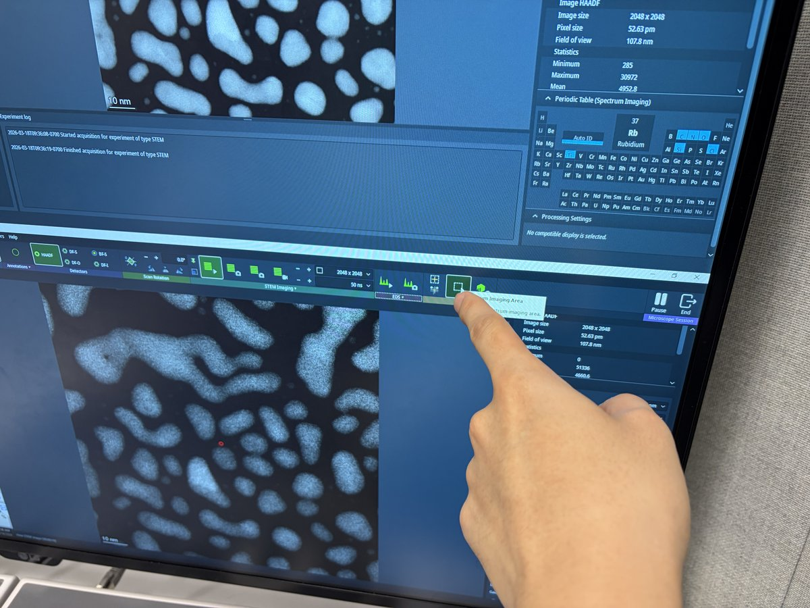
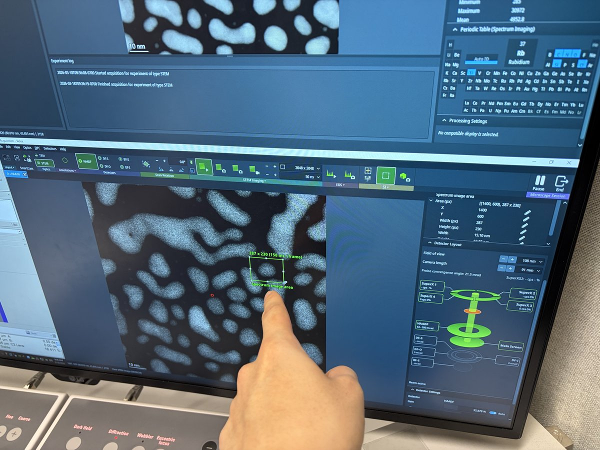
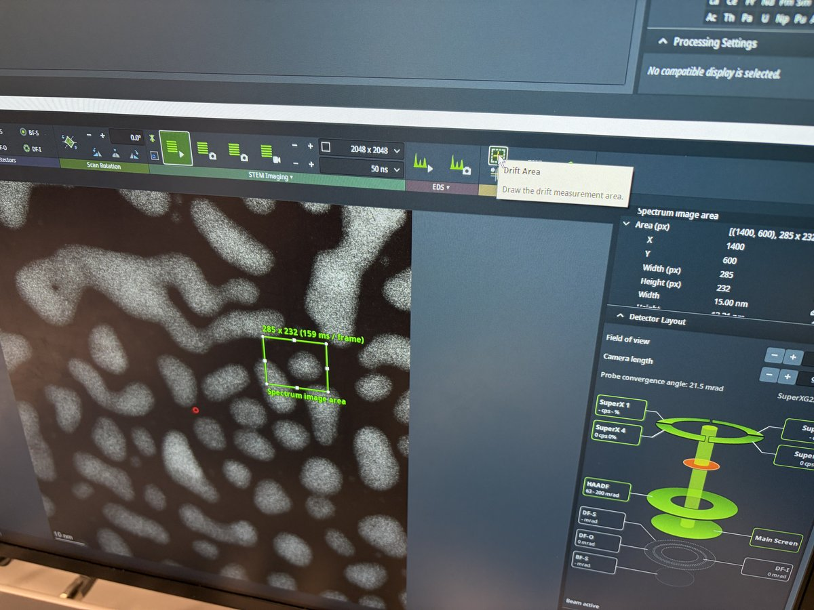
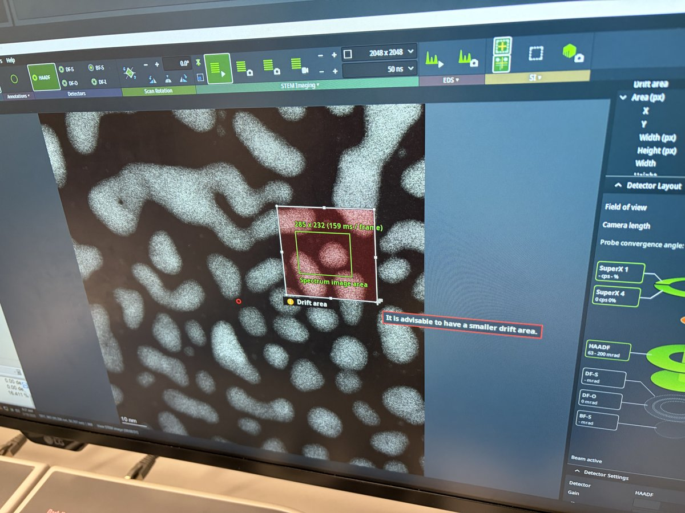
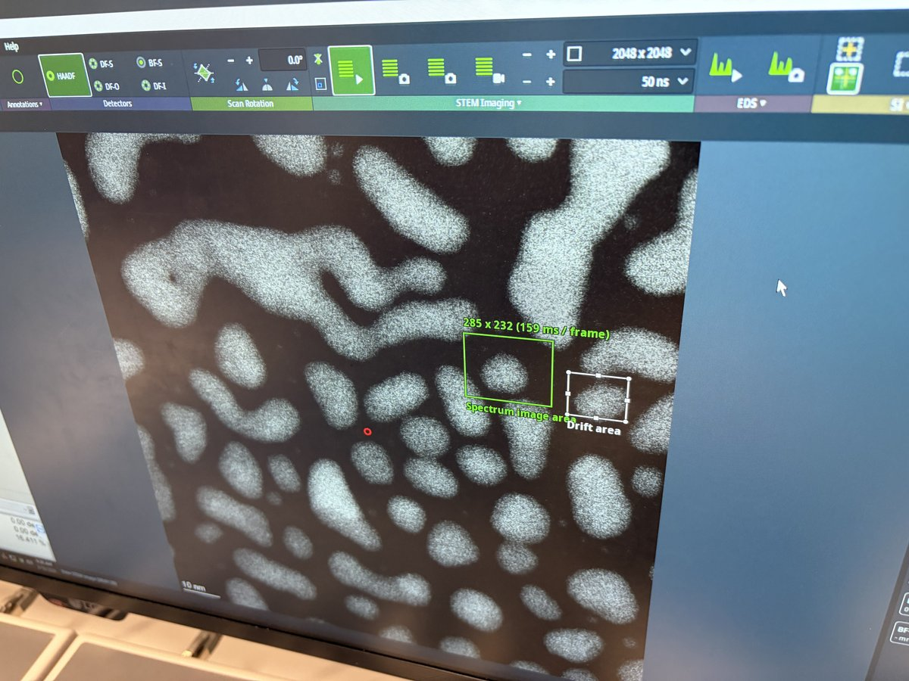
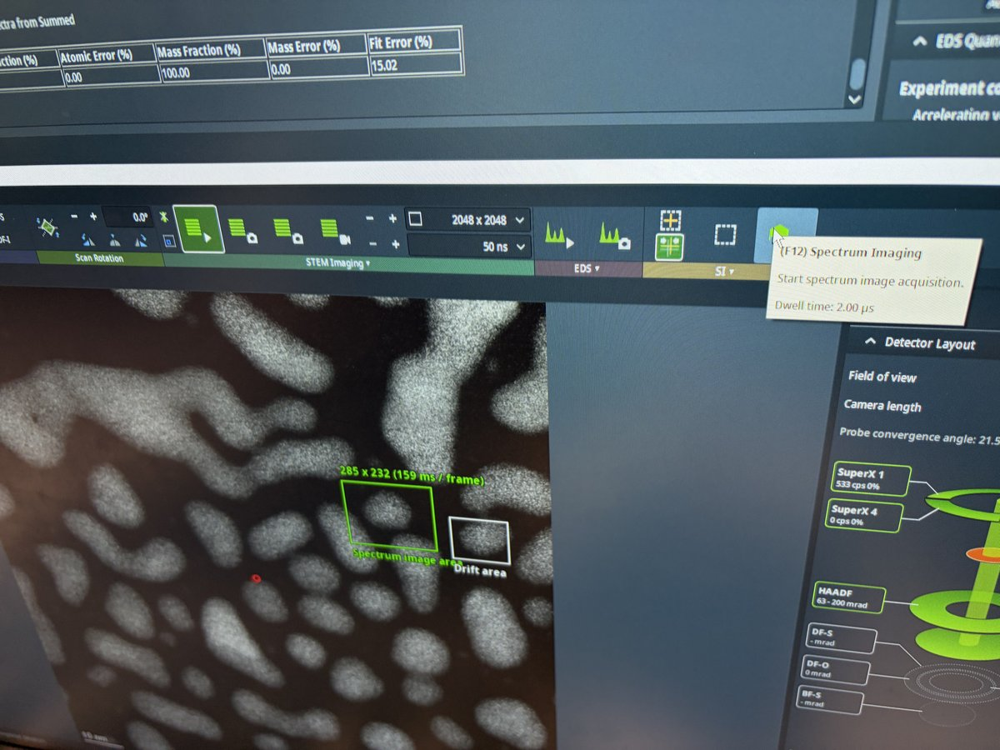
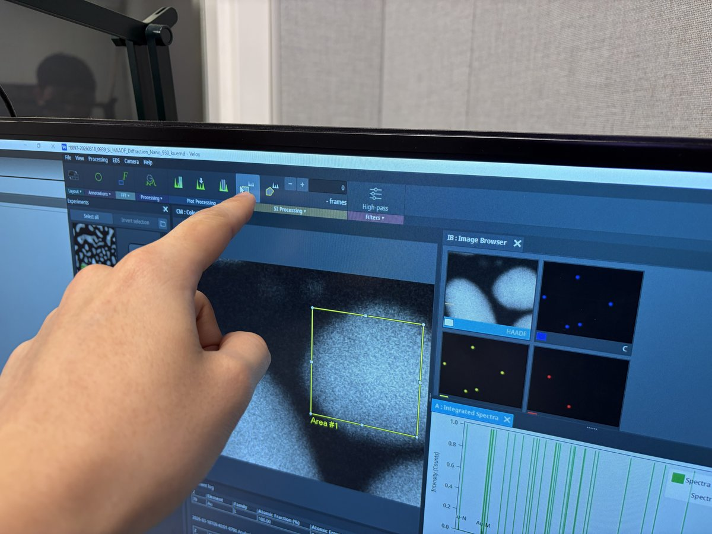
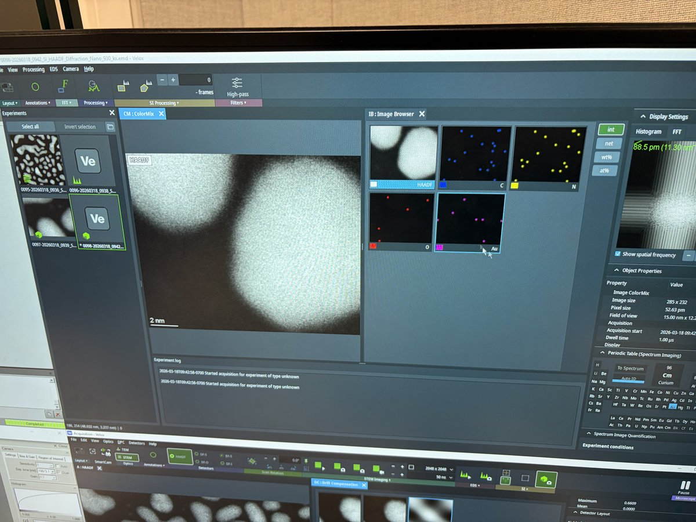
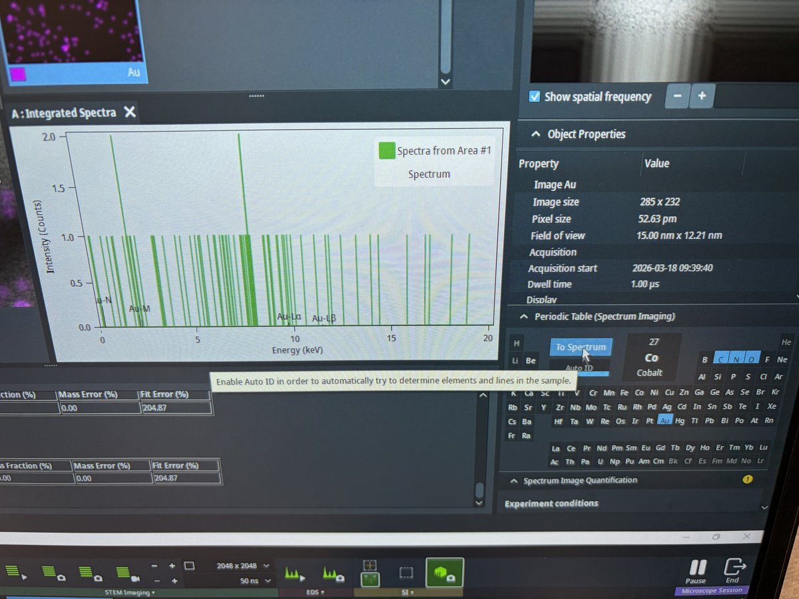
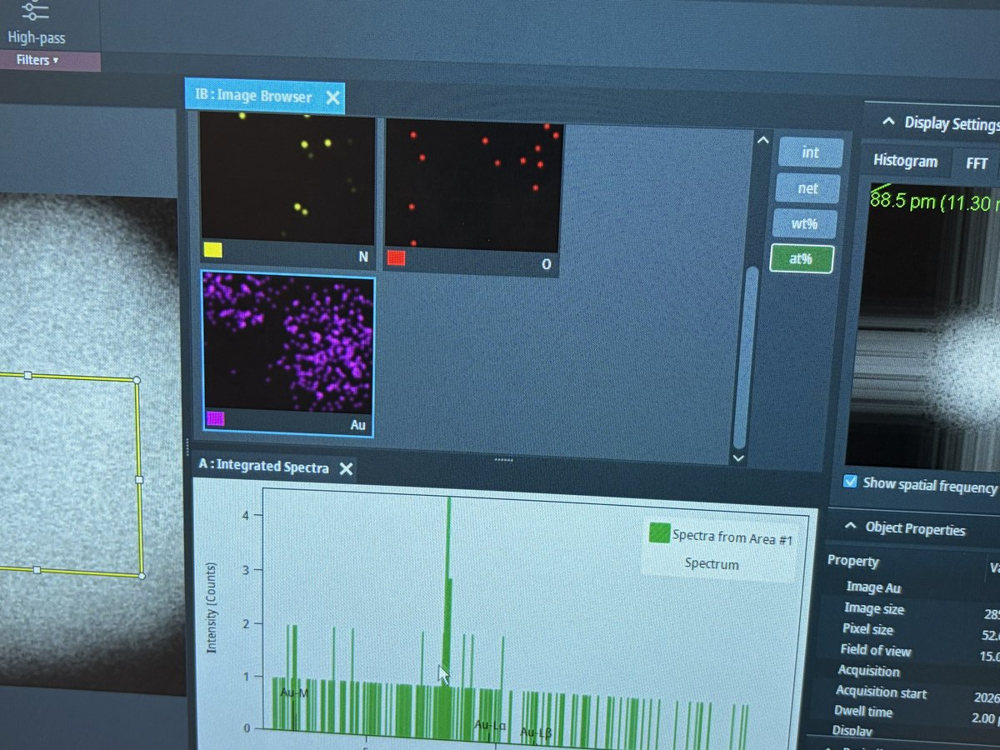

# EDS

> [!CAUTION]
> **VERY ROUGH DRAFT** - @bobleesj and Guoliang Hu took notes and pictures during training. This document will be updated with more detailed steps and images.

This guide covers Energy Dispersive X-ray Spectroscopy (EDS) on the Spectra 300. EDS identifies elements in a sample by detecting characteristic X-rays emitted when the electron beam knocks out inner-shell electrons. This guide uses the standard gold nanoparticle sample, so Au (gold) is the primary element expected in the elemental maps and spectra.

> **Prerequisite:** Complete the [STEM alignment](../spectra_STEM/index.md) procedure before starting.

**Acronyms:**

- `EDS` - Energy Dispersive X-ray Spectroscopy
- `SI` - Spectrum Imaging

## Overview

| Phase | Procedures | Time |
| ----- | ---------- | ---- |
| [Part 1: STEM mode EDS](#part-1-stem-mode-eds) | Set beam parameters, select imaging area, drift correction, acquire and process data | 15-30 min |

## Part 1: STEM mode EDS

### 1.1 Set beam parameters (optional)

- [ ] **Adjust convergence angle and beam current**

  1. In `TEMUI`, go to `Beam Settings`, select `Probe`, then click `MF-Y`
  2. Change convergence angle to approximately 21.5 mrad for EDS. A larger convergence angle focuses more current onto the sample, increasing the X-ray count rate.
  3. Increase screen current to ~0.4 nA. Higher beam current generates more X-rays but also increases sample damage. To adjust beam current, see [Monochromator tune](../spectra_STEM/index.md#16-monochromator-tune) in the STEM guide.

### 1.2 Select spectrum imaging area

- [ ] **Define acquisition area**

  1. In `Velox`, click `Spectrum Imaging Area` as shown below

     

  2. Draw a rectangle on the HAADF image to define the area for EDS acquisition

     

- [ ] **Set drift correction**

  1. Click `Drift Area` in the toolbar. A tooltip appears: "Draw the drift measurement area."

     

  2. Draw a small rectangle near a high-contrast feature. The system uses this region to track and correct specimen drift during acquisition.

     

  3. Verify both the spectrum image area (green rectangle) and drift area (white rectangle) are visible on the HAADF image.

     

### 1.3 Acquire and process data

- [ ] **Start acquisition**

  1. Click `Spectrum Imaging` to start acquisition. The tooltip shows the dwell time per pixel.

     

  2. Let the acquisition run for several frames so the software accumulates enough signal. Then click `To Spectrum` and `Auto ID` in the `Periodic Table` panel to identify elements from the spectra collected so far. You may also select elements manually if auto detection does not work.

     > **TODO:** Verify whether you need both `To Spectrum` and `Auto ID`, or just one of them.

- [ ] **Review elemental maps**

  1. Select a rectangular area on the HAADF image for map processing

     

  2. The `Image Browser` panel displays elemental maps for each detected element. Use the `Display Settings` on the right to toggle between intensity (int), net counts (net), weight percent (wt%), and atomic percent (at%) views.

     

  3. The `Integrated Spectra` panel below shows the X-ray spectrum from the selected area. The `Periodic Table` panel identifies detected elements. Under `Object Properties`, verify the acquisition parameters (image size, pixel size, field of view, dwell time).

     

  4. Elemental maps show spatial distribution of each element. In this example, N (green/yellow), O (red), and Au (purple) maps are displayed.

     

## End session

Follow the steps in [End session](../spectra_STEM/index.md#end-session) from the Spectra STEM guide.

## Acknowledgments

Thank you to Cedric Lim for teaching @bobleesj the EDS workflow during his session. Images captured during his session.

## Changelog

- Apr 3, 2026 - Replace images with new photos captured by @bobleesj during EDS training by Cedric Lim
- Dec 18, 2025 - Initial rough draft by Guoliang Hu and @bobleesj
