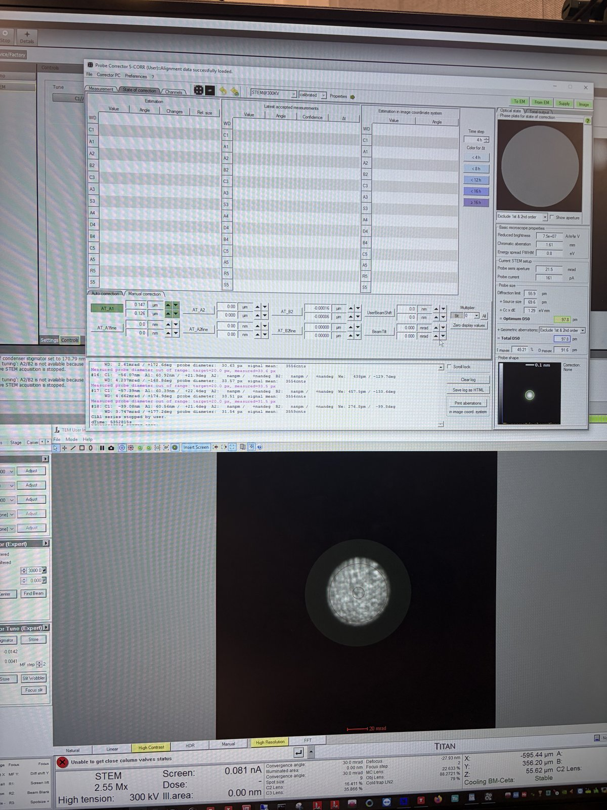
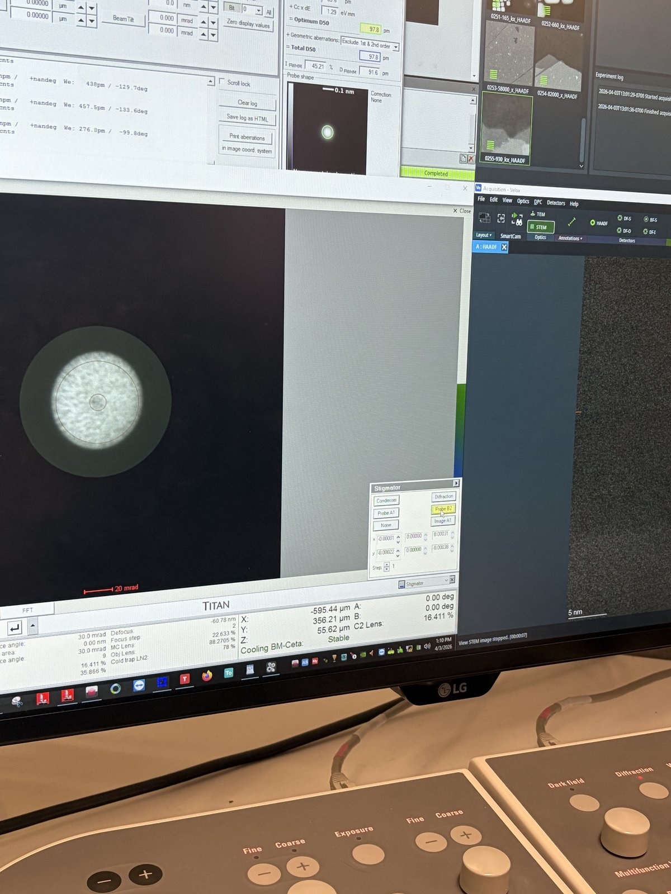

# Manual aberration correction (advanced)

> [!CAUTION]
> **VERY ROUGH DRAFT** - This guide is a collection of open questions and procedures to be verified during future practice sessions.
>
> **TODO:** Replace with real screenshots from a manual correction session on a beam-sensitive sample.

This guide covers manual aberration correction without `Sherpa` on the Spectra 300. `Sherpa` is an automated aberration correction tool that works well on high-contrast samples like gold nanoparticles (see [Fine-tuning with Sherpa](../spectra_STEM/index.md#32-fine-tuning-with-sherpa) in the STEM guide). However, manual correction is necessary when:

- **Beam-sensitive samples**: Sherpa's iterative scanning damages the sample before correction completes (e.g., organic or biological specimens).
- **Low-contrast samples**: Sherpa relies on image contrast to measure aberrations. If the sample has insufficient contrast, Sherpa cannot converge on a solution.

> **Prerequisite:** Complete the [STEM alignment](../spectra_STEM/index.md) through Part 2 (probe correction on the gold standard sample) before attempting manual correction on your own sample.

For an interactive visualization of how aberrations affect the ronchigram, see the [Ronchigram Simulator](https://bobleesj.github.io/electron-microscopy-website/ronchigram).

**Acronyms:**

- `mulXY` - Multifunction X/Y knobs on hand panel
- `TEMUI` - TEM User Interface (software)
- `A1` - Twofold astigmatism (probe stretched into an ellipse)
- `A2` - Threefold astigmatism (triangular probe distortion)
- `B2` - Axial coma (asymmetric "comet tail" probe shape)

## Before you start

This guide assumes you have already completed [Part 2: Probe Correction](../spectra_STEM/index.md#part-2-probe-correction) on the gold standard sample and loaded your own sample. The probe correction from the gold standard should largely carry over. However, sample loading and stage movement introduce small aberrations that need manual correction on your sample.

- [ ] **Find your sample region**

  1. Load your sample following [Sample loading](../sample-loading/index.md).
  2. Find your region of interest. After stage movement, wait ~5 min for mechanical stabilization before correcting aberrations.

## Two methods for manual correction

There are two independent methods to manually adjust aberrations. They use separate software and do not communicate with each other: changes in one are not reflected in the other. Use whichever method is more appropriate for your situation, or combine both.

| | Method 1: `Probe Corrector` | Method 2: Stigmator (`TEMUI`) |
|---|---|---|
| Software | `Probe Corrector S-CORR` (top left monitor) | `TEMUI` + hand panel |
| Where in column | Aberration corrector multipoles | Condenser lens system (above the corrector) |
| Controls | Arrow keys + `Multiplier` | `mulXY` knobs |
| Aberrations | All (A1, A2, B2, C3, etc.) | A1, Condenser stigmator, B2, etc. |
| Feedback | Aberration table + ronchigram | Ronchigram only |

## Method 1: `Probe Corrector` software

- [ ] **Adjust aberrations in Manual correction**

  1. In the `Probe Corrector` software, click the `State of correction` tab, then click `Manual correction`.
  2. Select an aberration parameter (e.g., `AT_A1` is selected in the image) and use the left and right arrow keys to adjust its value. Use the `Multiplier` to change the step size. Watch the ronchigram on the bottom monitor for live feedback as you adjust.

     

  > **TODO:** Define what "good" looks like without Sherpa. Determine criteria for the ronchigram, FFT, and probe shape.

## Method 2: Stigmator via `TEMUI` and hand panel

- [ ] **Adjust aberrations with the hand panel**

  > **TODO:** Verify the full procedure and which aberrations can be corrected via `TEMUI` (A1, Condenser stig, B2, etc.).

  1. Press the `Stigmator` button on the hand panel.
  2. When `Stigmator` is selected, the ronchigram automatically zooms in and out (the system oscillates the stigmator to show the effect). Adjust the `mulXY` knobs to make the ronchigram more circular (symmetric in both X and Y).

     

## Verify final correction

- [ ] **Check correction quality**

  1. Check the live FFT of the HAADF image. Rings should be round, not streaked.
  2. Switch to diffraction mode to view the ronchigram. The featureless central region should be circular and as large as possible. If it is elliptical, A1 still needs correction. If it is shifted to one side, B2 needs correction.

     > **TODO:** What is the minimum correction quality needed for atomic resolution on beam-sensitive samples?

## End session

Follow the steps in [End session](../spectra_STEM/index.md#end-session) from the Spectra STEM guide.

## Acknowledgments

Thank you to Parivash Moradifar for allowing @bobleesj to shadow her session and for teaching the manual correction workflow. Images captured during her session.

## Changelog

- Apr 3, 2026 - Initial draft with open questions by @bobleesj
