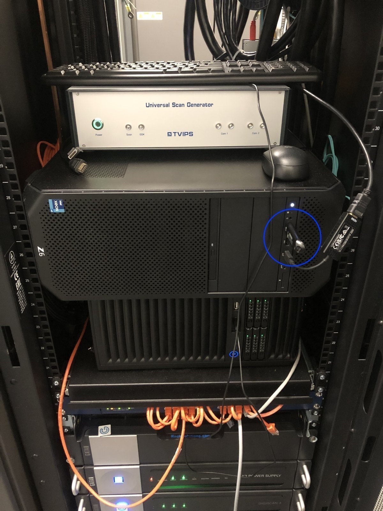
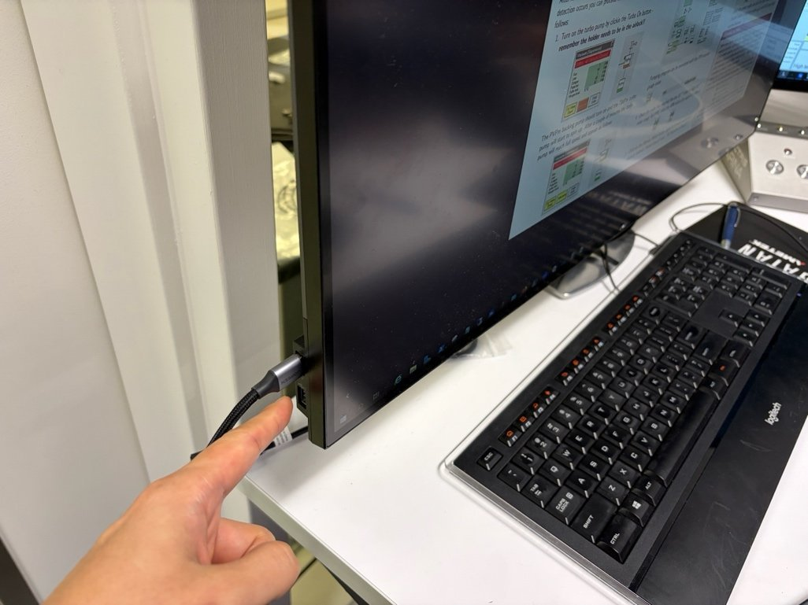
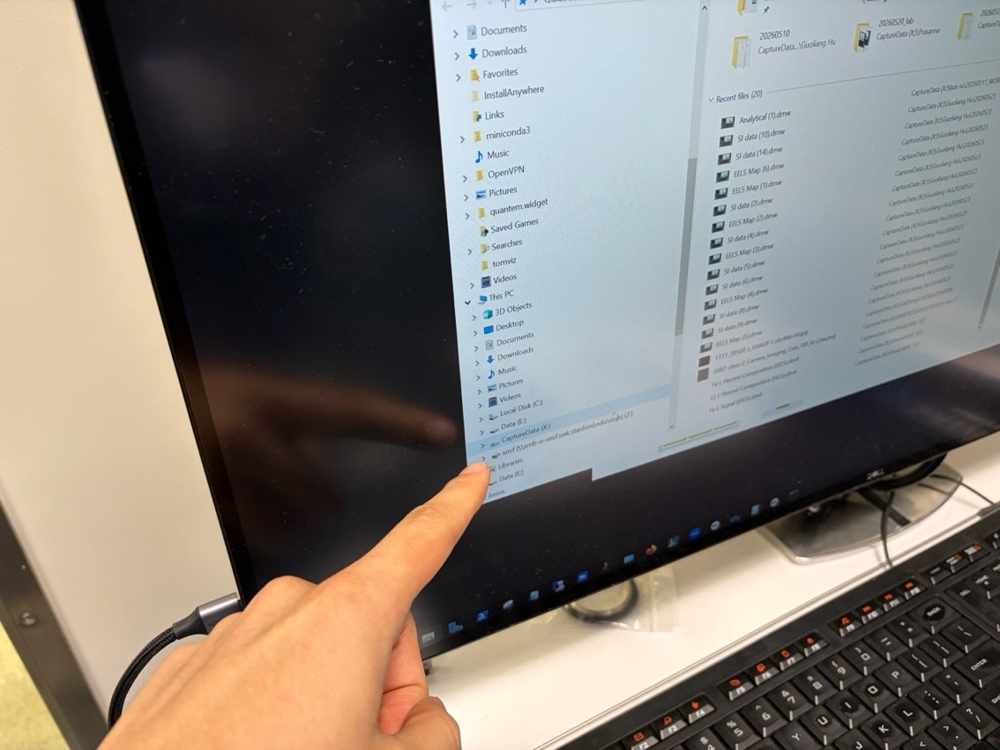
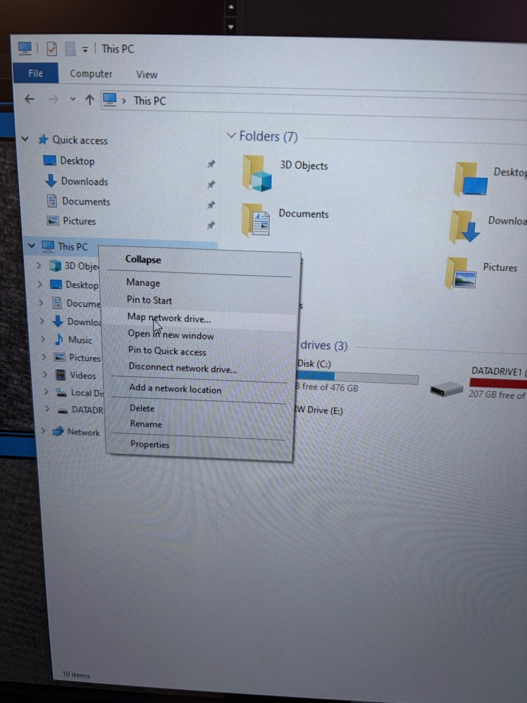
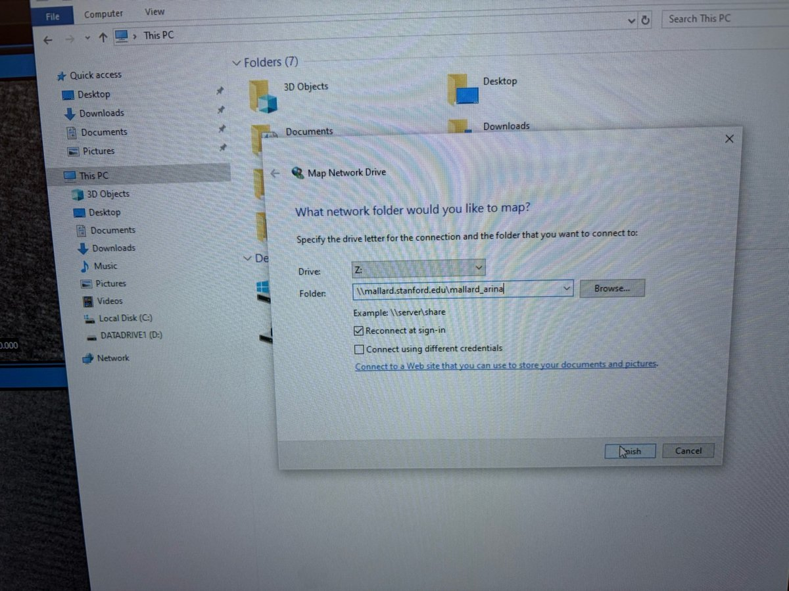

# Data transfer: Arina and Velox

This page covers how to get your data off the Spectra computers at Stanford SNSF: Arina 4DSTEM datasets and Velox HAADF `.emd` images to a USB drive, plus how to mount the lab Mallard network share for remote access. Drafted by Sangjoon Bob Lee from staff notes and images.

## Overview

| Task | How |
| ---- | --- |
| [Save Arina 4DSTEM data to USB](#save-arina-4dstem-data-to-usb) | Plug USB into the Arina PC, copy the dataset |
| [Save HAADF images to USB](#save-haadf-images-to-usb) | Copy Velox `CaptureData` folder to USB |
| [Mount the Mallard network share](#mount-the-mallard-network-share) | Map the lab share as a network drive |

## Save Arina 4DSTEM data to USB

- [ ] **Plug your USB into the Arina PC**

  1. Plug your USB drive into the computer below (the TVIPS scan generator PC). The USB port is circled.

     

- [ ] **Copy your dataset to USB**

  1. Open the NOVENA destination folder set during acquisition, find your session's `.h5` and `_master.h5` files, and copy them to your USB drive.

## Save HAADF images to USB

Velox saves HAADF images and other `.emd` files locally on the control workstation.

- [ ] **Plug in the USB drive**

  1. Insert your USB drive into the PC. It appears as a new drive in File Explorer.

     

- [ ] **Find the CaptureData folder and copy**

  1. Open the `CaptureData (X:)` folder. Velox saves your session's `.emd` files here, organized by date.
  2. Copy your dated folder to the USB drive.

     

## Mount the Mallard network share

For remote access to the lab data server, map the Mallard share as a network drive instead of copying to USB.

- [ ] **Open Map network drive**

  1. In Windows File Explorer, right-click `This PC` and select `Map network drive...`.

     

- [ ] **Enter the share path**

  1. Set `Drive` to `Z:` and `Folder` to `\\mallard.stanford.edu\mallard_arina`.
  2. Check `Reconnect at sign-in`, then click `Finish`.
  3. Enter the Mallard password when prompted. The password is in the pinned channel of the Colin Ophus group internal Slack.

     
