# Drop casting TEM grid preparation

> [!CAUTION]
> **VERY ROUGH DRAFT, NOT AUTHORITATIVE.** This is a personal journey written by @bobleesj (Sangjoon Bob Lee) during his first time drop casting. Photos and notes are his own; the actual experiments were done by **Guoliang Hu** and **Caitlyn Obrero**. Terminology, step ordering, and parameter values may be wrong or incomplete. The resulting grids have **not yet been imaged** to confirm the preparation worked. Treat this page as a starting point to refer back to, not as an SOP. A trained user must verify everything before relying on it.

This page documents how a TEM grid was prepared by drop casting a nanoparticle solution. The grid is first plasma cleaned to make the carbon film hydrophilic, then a small volume of solution is pipetted onto the grid and allowed to dry in air.

**Acronyms:**

- `easiGlow` : `PELCO easiGlow` glow discharge / plasma cleaner
- `TEM` : transmission electron microscope

**Materials:**

- TEM grids (e.g., carbon-coated copper, lacey carbon, holey carbon)
- Nanoparticle solution(s) in labeled vials
- Micropipette (0.5 to 10 µL range) with matching tips
- Anti-capillary tweezers
- Glass petri dish lined with lens paper or weighing paper
- Aluminum grid-holder plate for the `easiGlow`
- Filter paper or lens paper to wick excess solvent

## Location

Drop casting is done in the `PELCO easiGlow` bay in Nucleus Labs **W024** (Cryogenic Electron Microscopy) inside the Stanford ChEM-H Building.

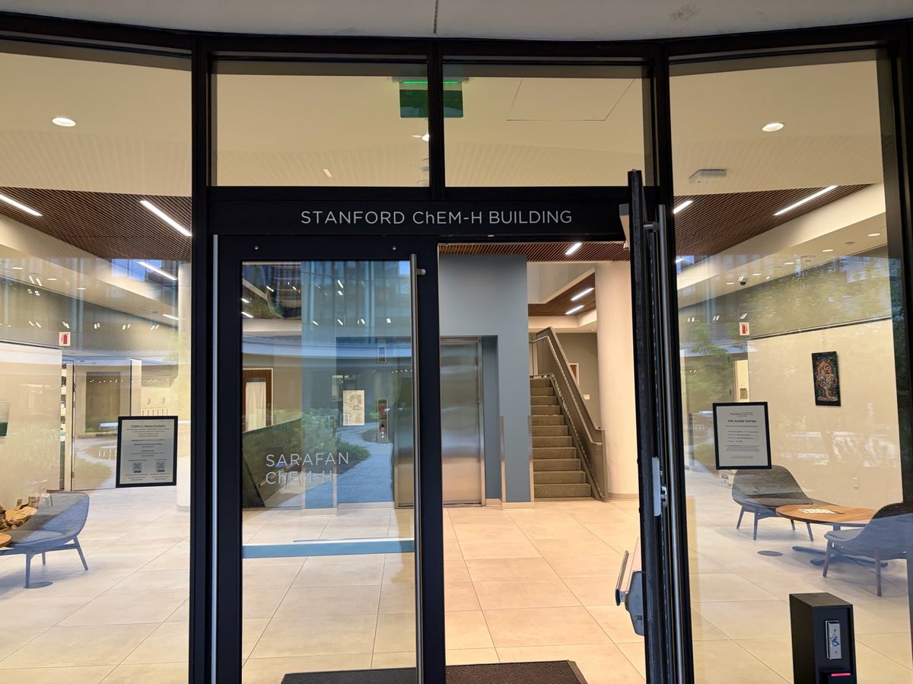

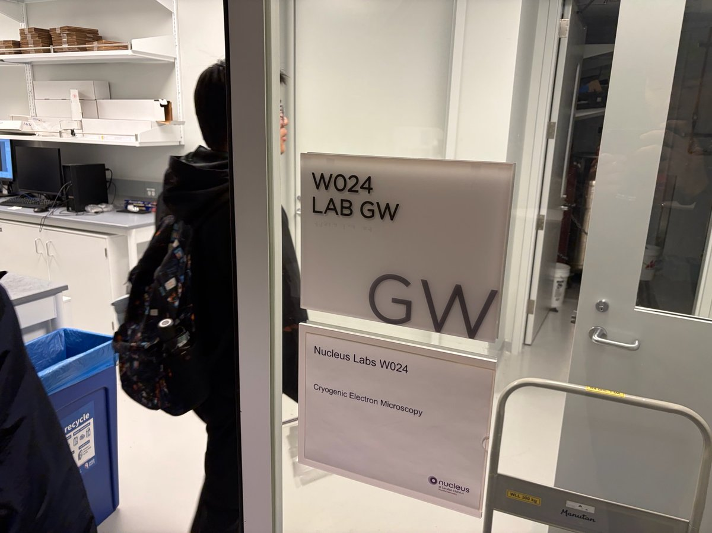

The `easiGlow` workstation sits next to the rotary pump and shares the bench with pipettes, tip boxes, and a gold-sample coupon. Solutions, tweezers, and grid boxes stay on the same bench.

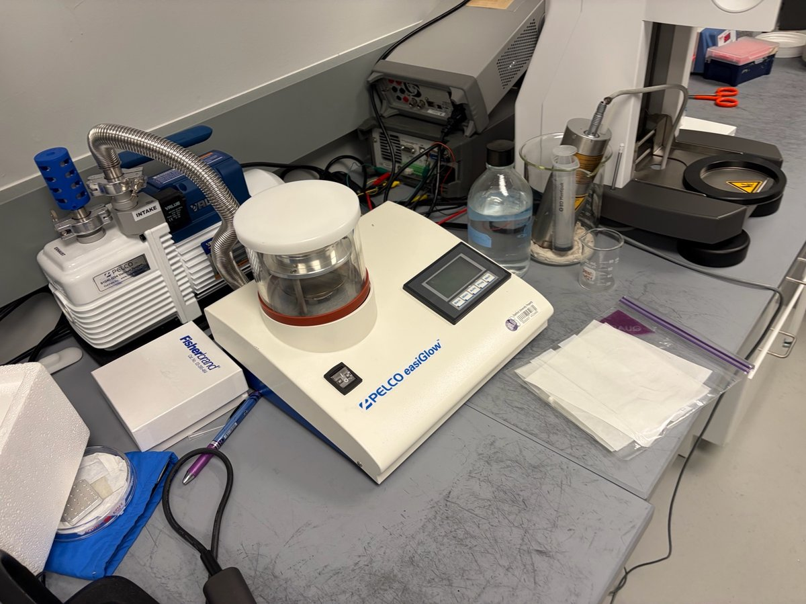

## Overview

| Phase | Procedure |
|-------|-----------|
| [Part 1: Plasma clean the grids](#part-1-plasma-clean-the-grids) | Load grids on holder, run glow discharge |
| [Part 2: Drop cast the solution](#part-2-drop-cast-the-solution) | Pipette sample onto grid, wick, dry |
| [Part 3: Store prepared grids](#part-3-store-prepared-grids) | Transfer dried grids to storage box |

> **TODO:** Record approximate time for each phase once the workflow has been repeated a few times.

## Part 1: Plasma clean the grids

Plasma cleaning removes organic contamination and makes the carbon support film hydrophilic, so the aqueous droplet spreads evenly instead of beading up. Skip this step and the solution will roll off the grid or concentrate at the edges.

### 1.1 Retrieve clean grids

1. **Open the grid box**

   A user must keep grids in a labeled grid box between uses to avoid contamination. Open the box gently: the grids are thin enough that a gust of air can flip them.

   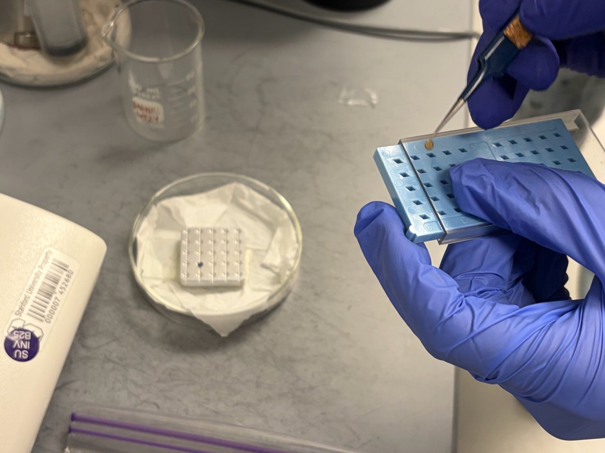

2. **Lift a grid with a fine-tip tool**

   Use a wooden toothpick tip, carbon-tipped vacuum pen, or anti-capillary tweezers to remove a grid. Hold the grid by the edge: pressing on the center will punch a hole through the carbon film.

   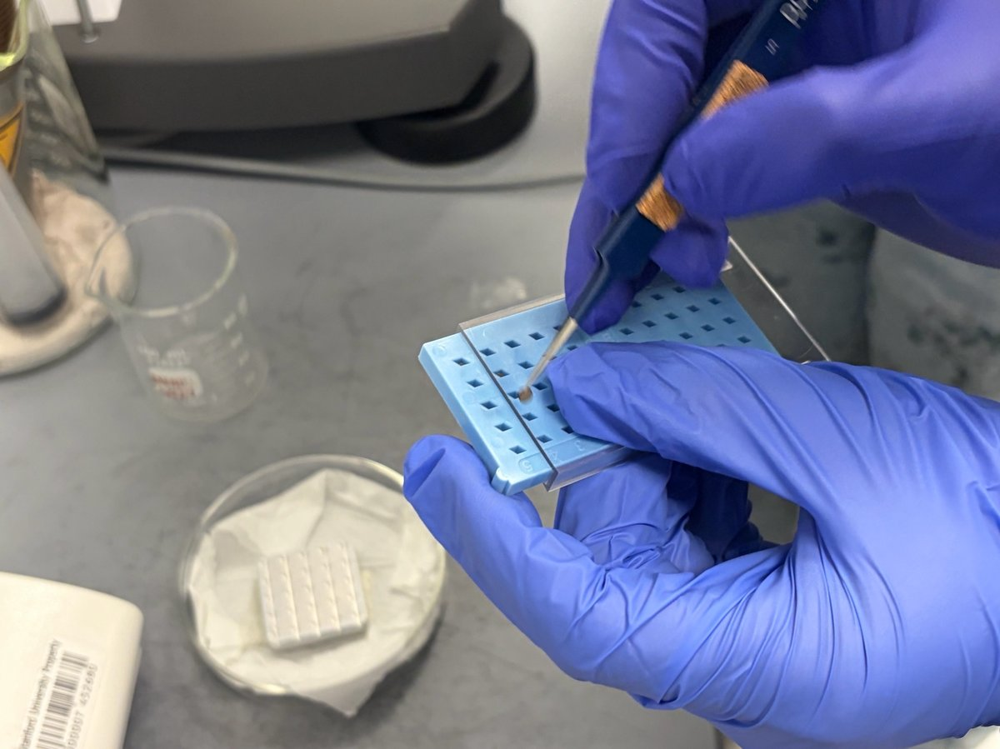

### 1.2 Load grids onto the easiGlow plate

1. **Place grids shiny (carbon) side up on the aluminum plate**

   The plate has rows of shallow circular wells sized for standard 3 mm grids. Shiny side up ensures the carbon film faces the plasma and becomes the hydrophilic surface.

   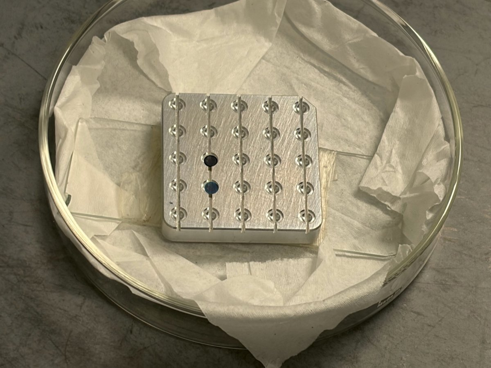

   > If you cannot tell which side is shiny, tilt the grid under the bench light. The side with the carbon film reflects more uniformly.

2. **Transfer the plate onto the easiGlow stage**

   Slide the plate onto the stainless steel stage inside the `easiGlow` chamber. Center it under the upper electrode.

   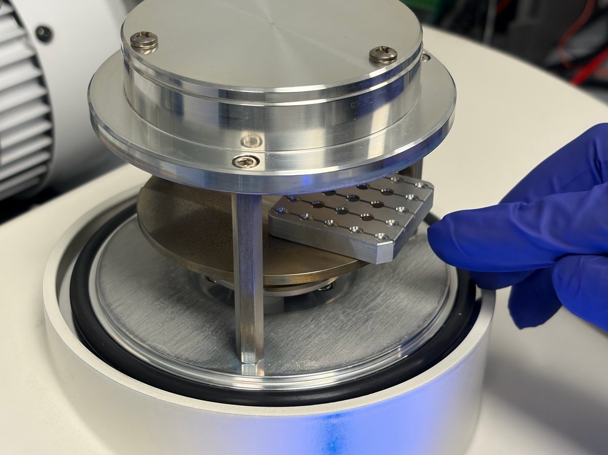

### 1.3 Run the glow discharge

1. **Close the chamber**

   Lower the bell jar onto the O-ring. Press down gently and evenly until you feel the seal engage.

   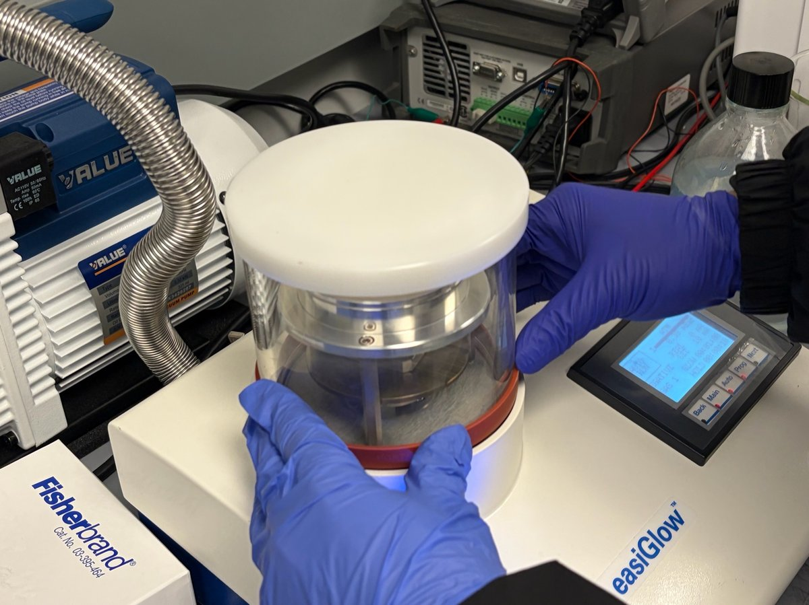

2. **Select the negative-glow program on the touchscreen**

   On the `easiGlow` control panel, set the following parameters:

   | Parameter | Value |
   |-----------|-------|
   | Mode | `NEGATIVE` |
   | Gas | `GAS 1` |
   | Pressure | **TODO:** confirm target pressure |
   | Current | **TODO:** confirm current (mA) |
   | Glow time | 60 s |
   | Hold time | **TODO:** confirm hold time |

   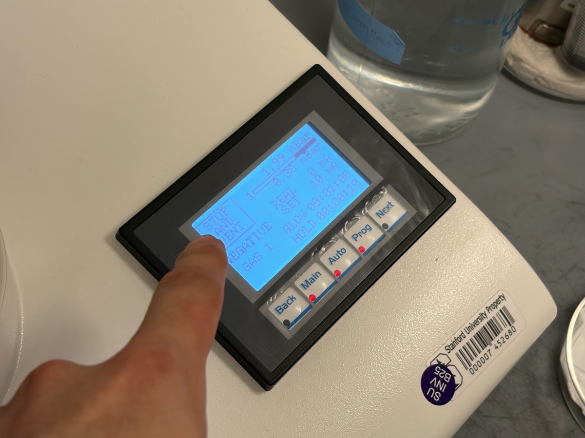

   > **TODO:** Record the exact pressure, current, and hold-time values from the staff-defined recipe the next time the instrument is used.

3. **Start the cycle**

   Press `Auto`. The pump pulls the chamber down to the set pressure, then the plasma ignites (a faint purple glow appears inside the bell jar). The cycle auto-vents at the end.

4. **Use the grids promptly**

   Plasma-cleaned grids lose hydrophilicity over time as the surface re-adsorbs ambient hydrocarbons. Prepare your solution and pipette tips **before** starting the glow discharge so you can drop cast immediately.

   > **TODO:** Confirm how long after glow discharge the grids remain usable.

## Part 2: Drop cast the solution

### 2.1 Prepare the solution

1. **Check that your sample vials are labeled and in a rack**

   Each vial should have a unique label (e.g., `S1-3`, `S2-1`) matching your lab notebook. Vortex or gently invert any solution that has sat for more than a few minutes to resuspend settled particles.

   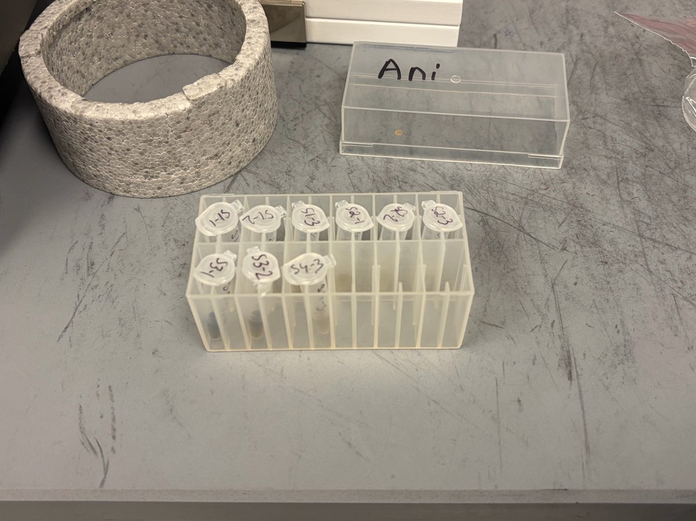

2. **Mount a fresh tip on the micropipette**

   Use a tip that matches your pipette (e.g., `SL-10 XLS`, 0.5 to 10 µL). A fresh tip prevents cross-contamination between samples.

   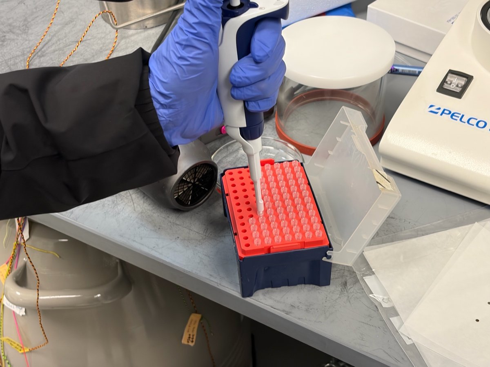

### 2.2 Pipette onto the grid

1. **Draw solution from the vial**

   Press the plunger to the first stop, dip the tip into the solution, and release slowly to draw the volume. Avoid drawing air: a bubble at the tip will spray the droplet off the grid.

   > **TODO:** Record the volume actually used (microliters) and the pipette model/range.

   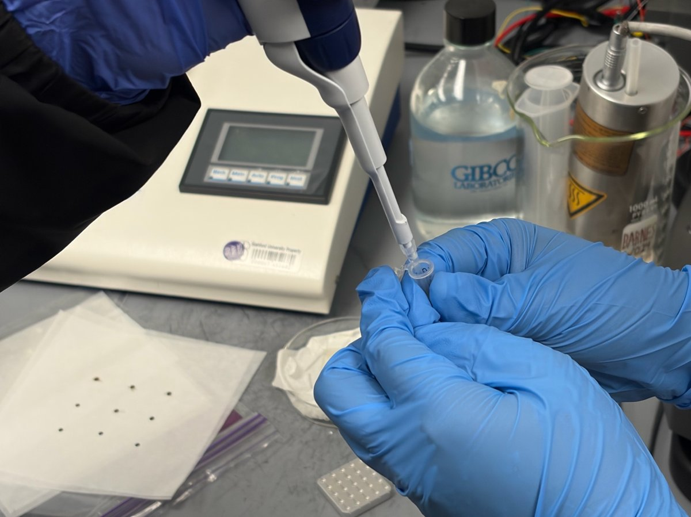

2. **Deposit the droplet on the grid**

   Hold the pipette vertically above the grid. Touch the droplet to the grid surface so it wets across the film. Do not press the tip into the carbon film.

   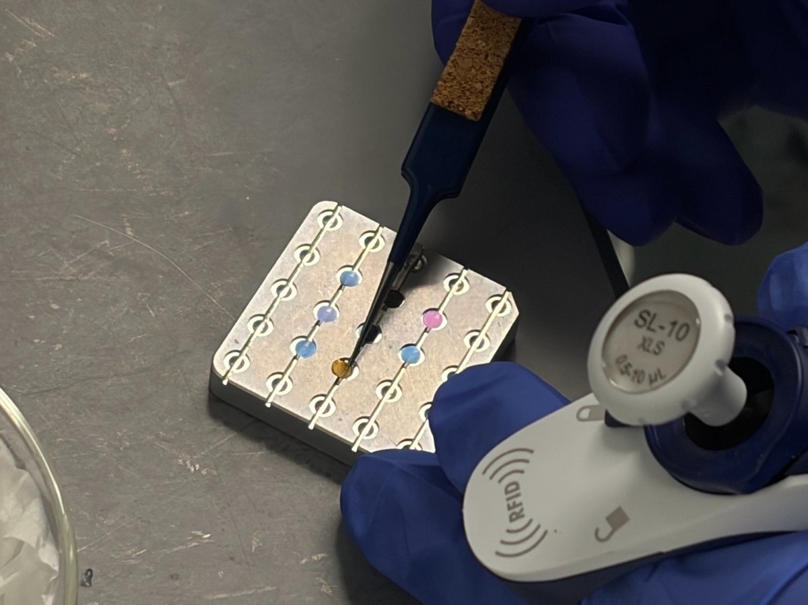

   > If the droplet beads up and rolls off, the grid was not plasma cleaned recently enough. Repeat [Part 1](#part-13-run-the-glow-discharge) with a fresh grid.

### 2.3 Wick and dry

1. **Transfer the grid onto a piece of lens paper**

   Place the grid sample-side up on clean lens paper or filter paper. The paper wicks excess solvent from the edges without disturbing the deposited particles.

   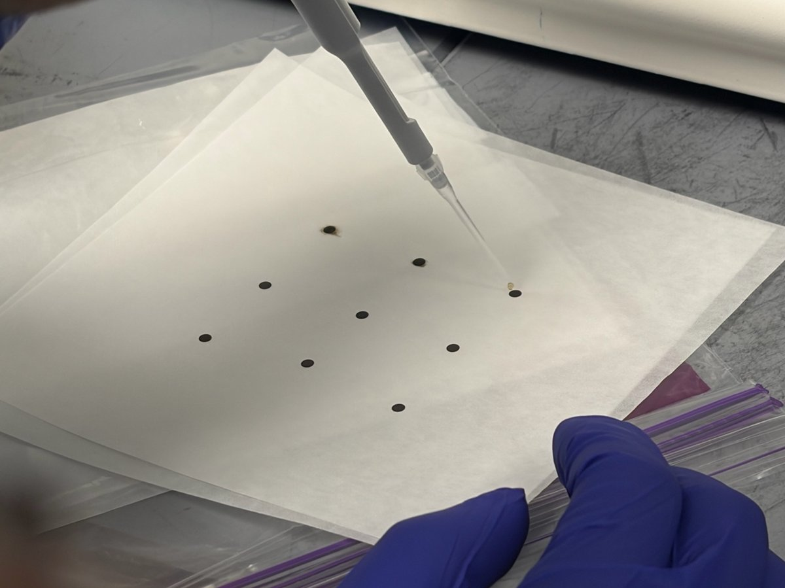

2. **Let the grid air dry**

   Wait until the droplet is fully evaporated. Drying time depends on the solvent and droplet volume.

   > Do **not** blow on the grid to speed drying. Breath moisture deposits contamination, and forced airflow can redistribute particles asymmetrically.
   >
   > **TODO:** Record actual drying time for the solvent(s) used.

## Part 3: Store prepared grids

1. **Pick up the dried grid with anti-capillary tweezers**

   Grip the grid by the edge only. The dark dot visible in the center is the dried sample: touching it will scrape particles off.

   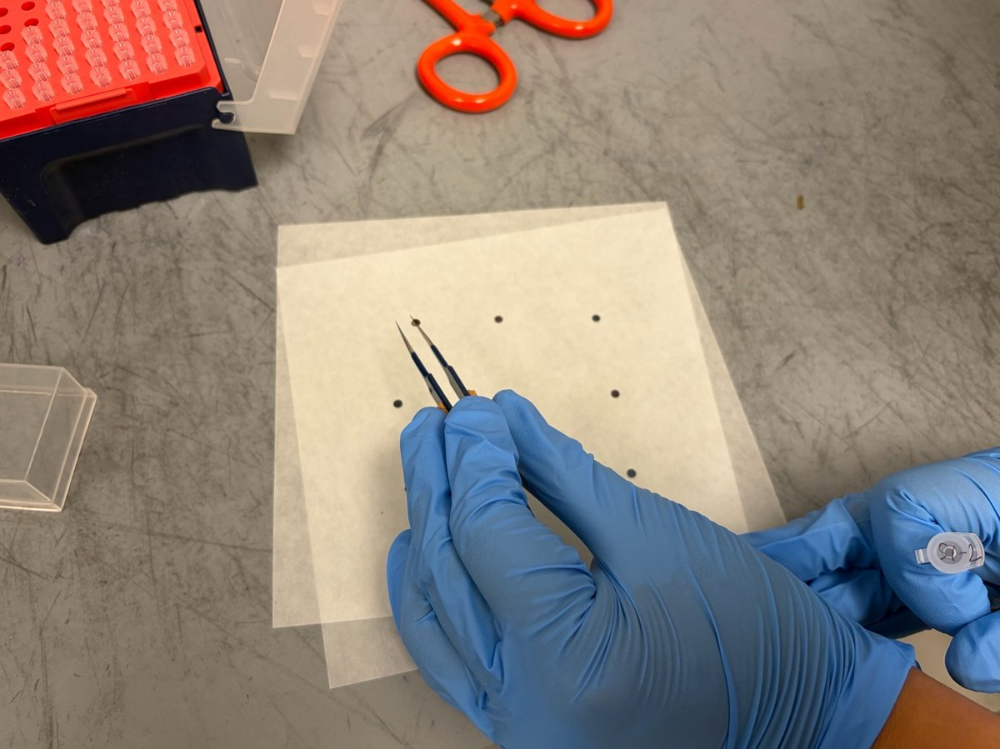

2. **Return the grid to a labeled grid box**

   Note the well number and sample ID in your lab notebook.

   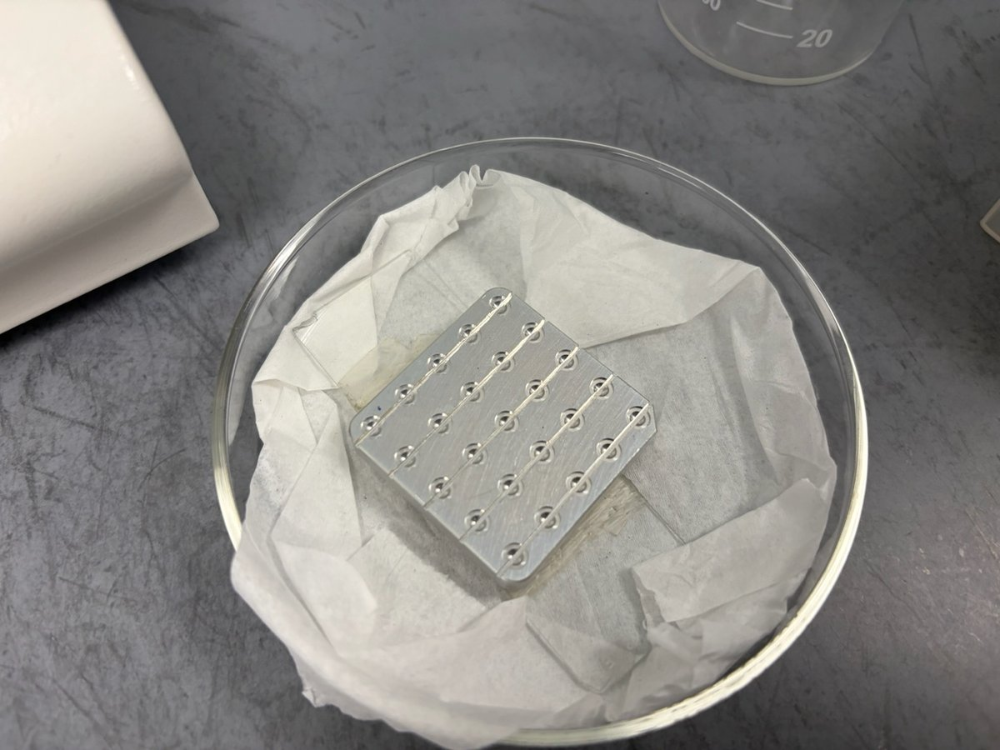

## Troubleshooting

> **TODO:** This table is generic drop casting guidance, not validated against the actual SNSF workflow. Verify with Guoliang Hu or Caitlyn Obrero before relying on it.

| Symptom | Likely cause | Action |
|---------|--------------|--------|
| Droplet beads up and rolls off | Grid not plasma cleaned or surface re-contaminated | Re-run glow discharge with a fresh grid |
| Particles concentrated at droplet edge (coffee-ring) | Solvent evaporated too slowly or grid not level | Reduce droplet volume, or wick the edge with filter paper |
| Carbon film torn | Pipette tip touched the grid | Lower the droplet without contacting the film |
| No plasma ignition | Chamber not at base pressure | Reseat the bell jar, wipe the O-ring |
| Visible aggregates on grid | Solution not resuspended | Vortex sample, dilute, repeat |

## Changelog

- Apr 22, 2026 - Initial draft captured during first drop casting session. Photos and notes by @bobleesj. Experiments by Guoliang Hu and Caitlyn Obrero. Output not yet verified by TEM imaging.
