# Session notes

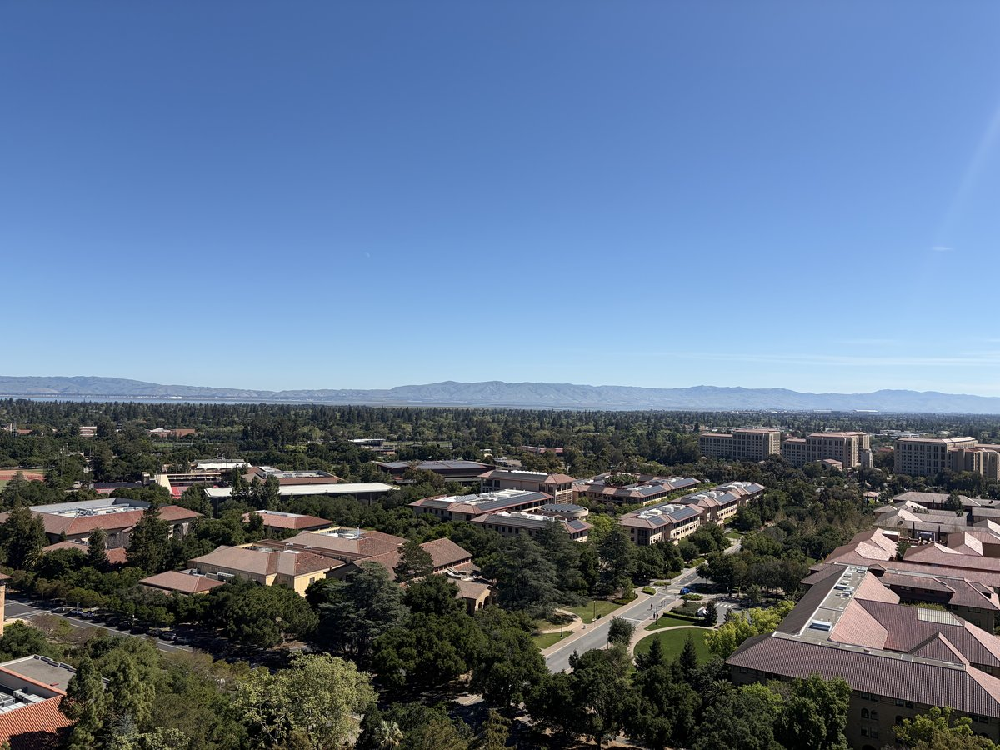

*View from Hoover Tower, Stanford, Mar 24, 2026*

*by Sangjoon Bob Lee*

This is a working scratchpad for raw notes taken during microscopy training visits and sessions. Notes here capture practical tips, questions, and observations from hands-on time at the instrument. Over time, useful content gets refined and incorporated into the proper guide sections.

**Open questions to verify at the microscope**
- [ ] For C1A1, during the first run, what are the target values? I started with C1 6 nm, A1 27 nm, B2 928 nm. My notes say C1 < 1 nm and A1 < 3 nm. Add target values to the table.
- [ ] Add a table at the beginning with the target values for aberration corrections.
- [ ] When to change condenser stig? Need to verify on the Spectra what the beam looks like before and after condenser stigmator correction.
- [ ] What is the minimum correction quality needed for atomic resolution?
- [ ] Investigate the effect of descan when you integrate or sum across k-space.

**Hands-on practice (need to do on my own)**
- [ ] Try going back to TEM and STEM, confirm aberrations getting worse.
- [ ] Try going to LM and then back to regular STEM, confirm resolution getting worse.
- [ ] Try correcting the probe without Sherpa, in the case of beam sensitivity.

**Answered**
- [x] (Apr 3) When do you run Stigmator? Both with the ronchigram (diffraction mode) and directly in HAADF imaging (probe image mode).
- [x] (Apr 3) When do you do manual tuning? Yes, with real samples when Sherpa can't be used. See [Aberration Correction (Advanced)](aberration-correction/index.md).
- [x] (Apr 3) Figure out the full workflow for correcting aberrations without Sherpa. See [Aberration Correction (Advanced)](aberration-correction/index.md).
- [x] (Apr 3) Where do you run C1A1 if you can't expose the sample? Run on the gold standard first, then switch to your sample. See [Aberration Correction (Advanced)](aberration-correction/index.md).
- [x] (Apr 3) What does "good" look like without Sherpa? See [What a good probe looks like](#mar-25-2026-spectra-300-imaging-quality-after-probe-correction-at-snsf) in the Mar 25 session.

---

## Apr 23, 2026: Underfocus vs overfocus on the Talos (MATSCI 322)

A short follow-up session in the **Stanford MATSCI 322 TEM Lab** (with **Andrew Barnum**, **Pinaki Mukherjee**, and **Ash**) to nail down what under- and over-focused images actually look like on the Talos FluCam, using latex spheres as the test object.

### Underfocus

Turn the intensity knob **counter-clockwise** from focused crossover. This strengthens the C2 lens (C2 current increases), which is **underfocus** from the C2 lens perspective: the C2 focal point moves upward relative to the eucentric height (negative defocus relative to eucentric).

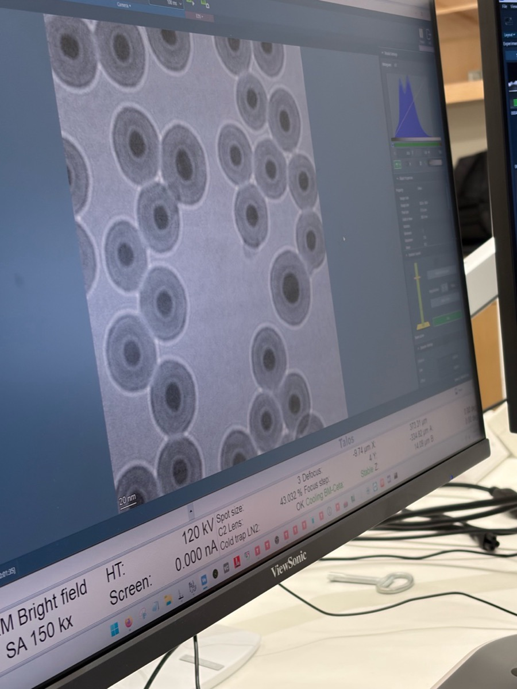

Visual signature: a **bright ring on the outside** of each sphere.

### Overfocus

Turn the intensity knob **clockwise** from focused crossover. This weakens the C2 lens (C2 current decreases), which is **overfocus** from the C2 lens perspective (positive defocus relative to eucentric).

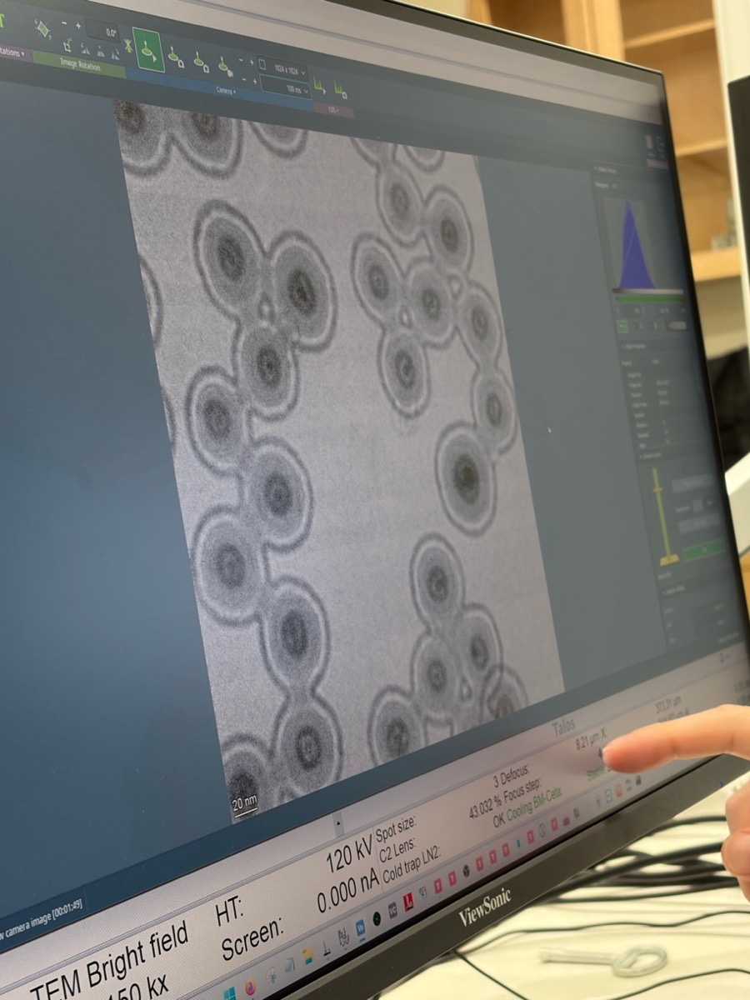

Visual signature: a **bright ring on the inside** of each sphere.

### The two sign conventions are opposite

- From the **C2 lens perspective**, "underfocus" means the lens is stronger (C2 current up); "overfocus" means weaker (C2 current down).
- From the **beam perspective**, "over" means the focal plane is past the sample, so the "over" region sits below the sample.

Record which convention is in use when interpreting a defocus value during a session. Treat the eucentric height as the source of truth: a calibrated defocus reading on the instrument is given relative to the eucentric position.

---

## Apr 3, 2026: Time-series for beam sensitive and low contrast at SNSF

I implemented live SSB reconstruction and also learned to fill up nitrogen in Spectra. Today, I joined Parivash Moradifar's session to shadow for manual aberration correction, and Dasol's session for beam-sensitive sample imaging.

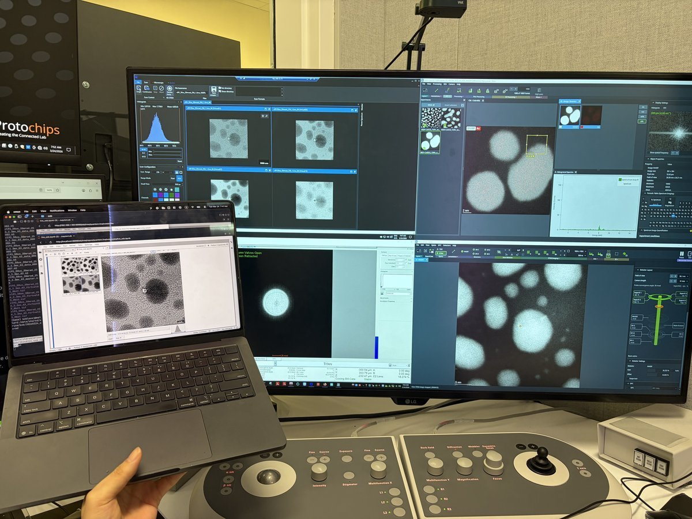

The benefit of live SSB is that you can also find the gold zone axis and verify crystallographic orientation from the reconstruction, not just from the ronchigram.

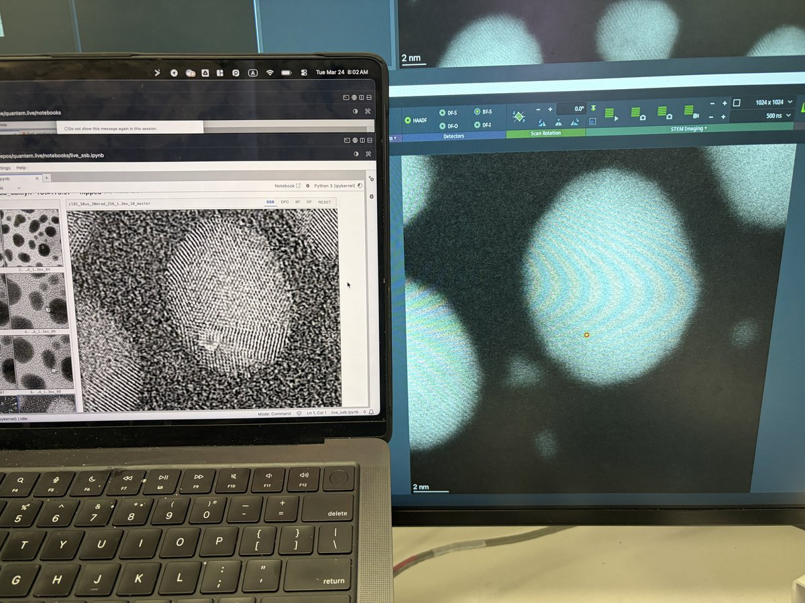

- We encountered a thick silicon nitride grid (~100 nm) that interacts with the incoming electrons. Silicon nitride grids are sinuous, so the resulting images look jiggly.
- I also learned how to reduce contamination via beam shower. It is typically done in TEM. In STEM mode, go to really low defocus using z-axis and have current around 0.200 nA. It will reduce contamination.

## Mar 25, 2026: Spectra 300 imaging quality after probe correction at SNSF

Spectra 300 at SNSF after completing the full STEM alignment and aberration correction on the gold nanoparticle standard sample. The HAADF image provides a standard.

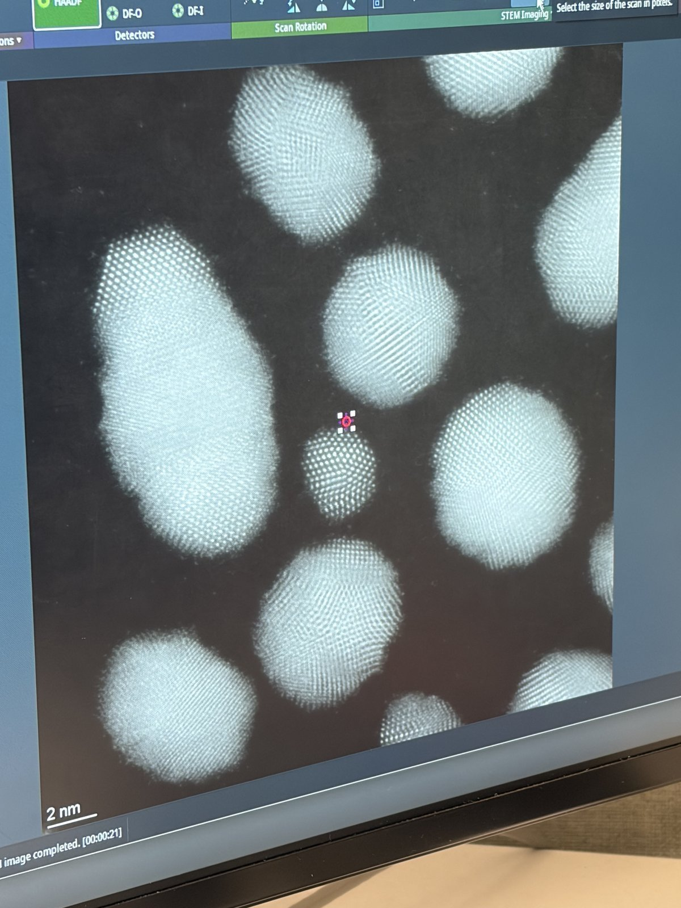

The FFT confirms 74.5 pm resolution (4096x4096 image, pixel size 6.579 pm, 26.95 nm field of view).

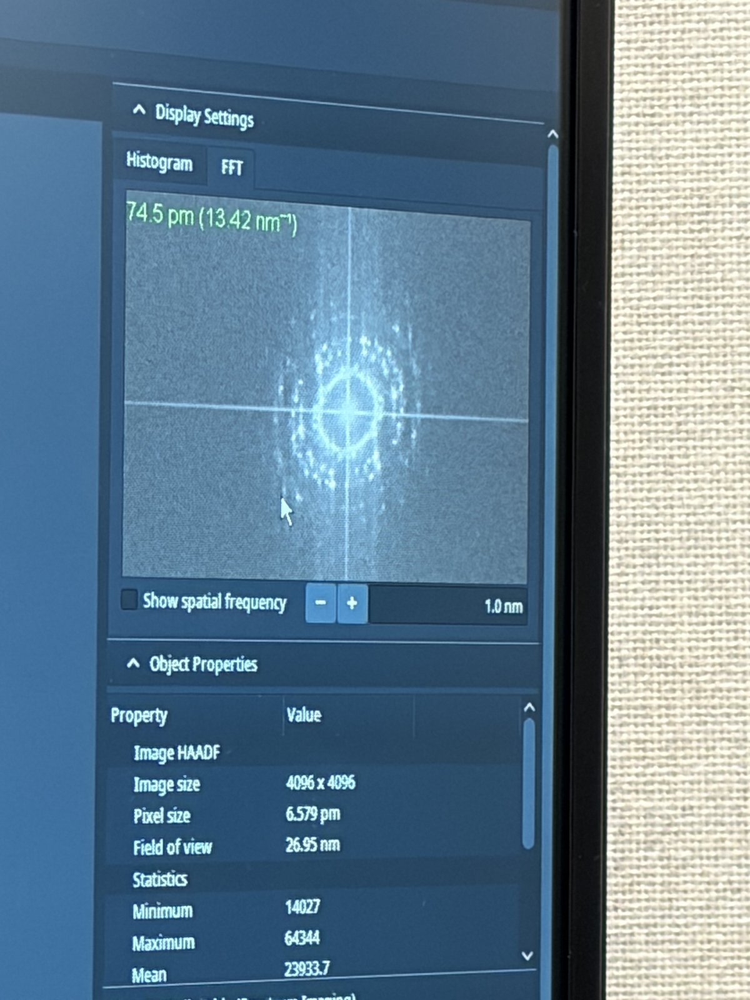

**What a good probe looks like after aberration correction:**

Tableau measurement showing under-focus and over-focus ronchigram tiles. Each tile should show a round, symmetric probe. The C1A1 values at the bottom show the aberration measurements converging.

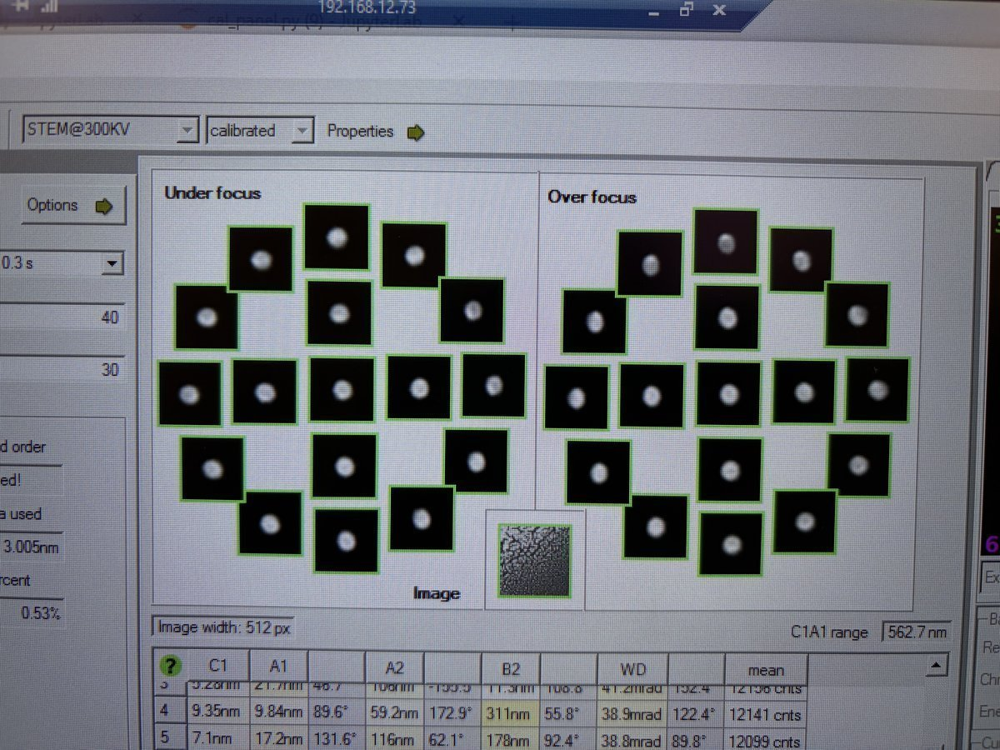

State of correction showing the aberration table and phase plate. The phase plate (green/purple visualization) should show a flat, symmetric pattern within the semi-aperture circle. Probe current is 161 pA, semi-aperture 30 mrad, probe size 40 pm.

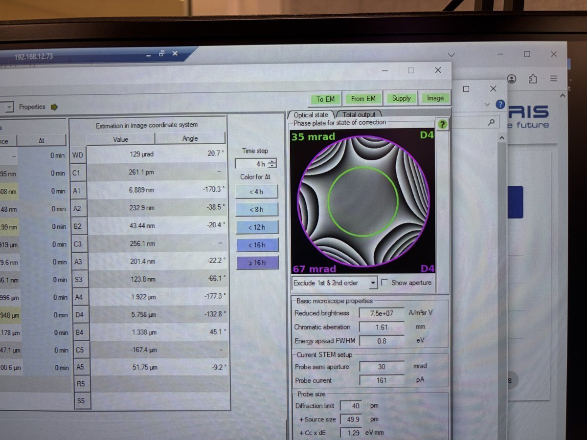

Ronchigram after correction. This is considered good: the featureless central region is large, round, and extends well beyond the 20 mrad scale bar. The red circle marks the semi-aperture boundary.

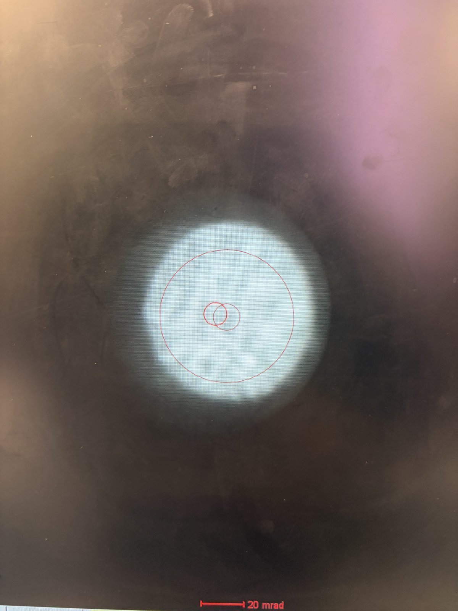

## Mar 14, 2026: Improve resolution using the Spectra SOP and feedback

How to find the ronchigram again?
- Move the joystick around and watch for a small screen current change.
- Then use Diffraction Shift and Focus alignment to find the beam. You will see a faint bit of light.

Open questions
- Ideal Velox play setting? 1024x1024 and 500 ns for gold standard sample.
- Camera length and ronchigram size? Proportional: 91 mm to 115 mm, ronchigram size also increases.
- When do you adjust Condenser?

Lessons learned
- Beam condition from FFT: 4-6 rings, each ring with discrete peaks, ~70 pm. Further rings (bigger k) correspond to sharper features resolved in real space.
- Beam condition from Probe corrector: flatness around the "green" aberration surface is the key.
- Overfocus means focal point above the sample; underfocus means below it.
- Defocus change DP? Barely, but real-space probe size is changed (needed for ptycho overlaps).
- Defocus on BF? Expect it to get worse. Ptycho will perform better.
- Focus knob to sharpen? Minimize it. Don't add degrees of freedom. 20 nm max, use stage piezo and knobs.
- Finding ptycho defocus step size: use ronchigram shadow image to determine feature size variations. Step size of 1 nm is too small.
- Why drift? Inserting the holder itself induces aberrations. After stage movement, find ROI, then wait ~5 min for mechanical stabilization.

Extra notes on aberrations
- Practice getting atomic imaging without Sherpa. Example: Samsung sample, too beam-sensitive for Sherpa.
- Tableau with A5 selected measures up to 5th order aberrations.

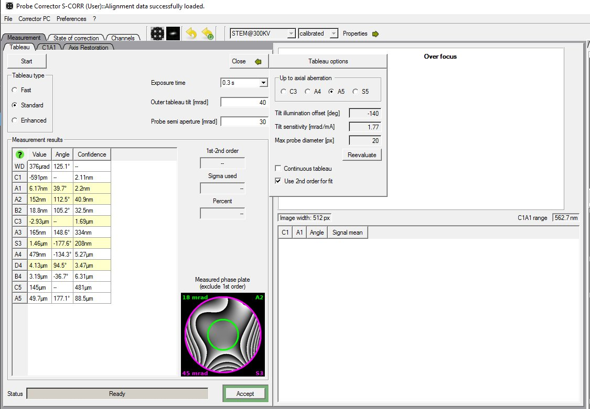

## Mar 9, 2026: Ptychography reconstruction basics

Notes from Arthur on reconstructing data collected from ARINA detector at Stanford.

- **Sign convention:** in `quantem`, `C10 > 0` means underfocus. The beam focal point is below the sample, hence negative defocus.
- **Aberrations:** SSB is somewhat an "eye test." One may use the aberrations from SSB or not. There are many degrees of freedom: batch size, the "dose" step size (finer can be better), probe size, center of mass/transpose, and initial aberrations.
- **Cropping strategy:** in real space, it's fine to crop, encouraged since faster. In k space, we generally don't want to crop since we lose the max scattering angle, i.e. we lose fine details in real space.
- **Probe:** aberrations should be identical across all scan regions in theory. However, for ptycho-tomo, defocus will change with tilt.
- **CNN reconstruction:** reconstruction weight is different between reconstructions since these are weights being trained.
- **Memory:** It's hard to manage memory well in Jupyter notebook but it's something we can work on.
- **Virus samples:** there is no zone axis, so we can't do atomic resolution.
- **Descan:** the beam is tilted from the source and then tilted back after a short travel perpendicular to the sample. During this second tilt, instability can be introduced and the diffraction pattern isn't perfectly aligned.
- **Mixed probe:** mixed probe is good and orthogonality is imposed, so probes should look different from each other.

## Mar 3, 2026: My cobalt oxide nanoparticles 4DSTEM at SNSF

It was my first time staying in STEM mode and find samples after STEM probe correction and loading my own sample. The following notes were taken in my attempt to find the feature of interest right after the sample was loaded.

- Go to **5,000× magnification**. If there is no beam, it means the beam is blocked on the grid. Move the stage around with the joystick.
- Move the stage until the **screen current increases to about 0.150 nA**. At this point, the beam has been found. Notice the Kikuchi bands: this is a good clue that you are in a good starting place.

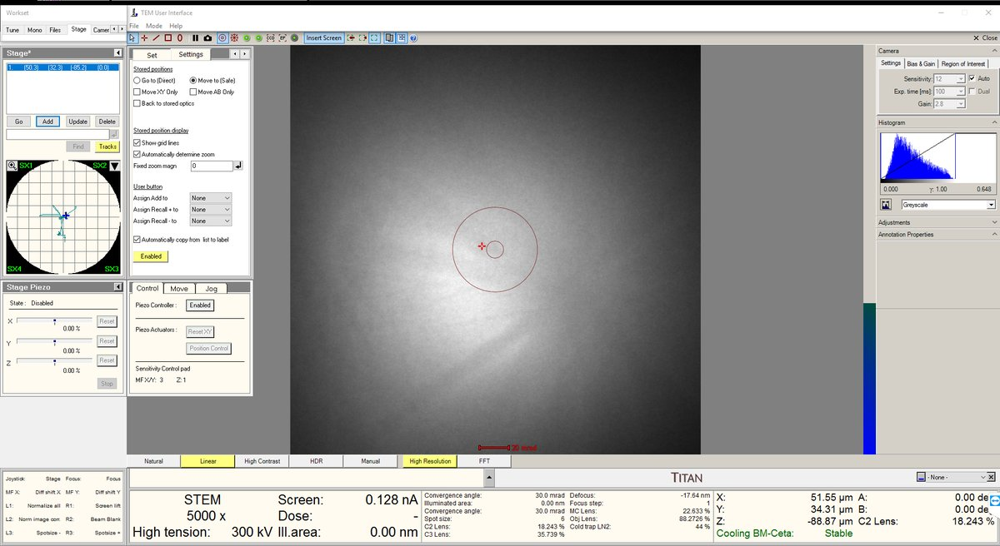

- Increase the magnification to **20,000× or higher**. The features will still look blurry since we are not yet at the correct focus.
- Press the **Z-axis up and down** until the **Ronchigram blow-up point** appears. Adjust z-axis from 5kx to 20kx to find the blow-up point.

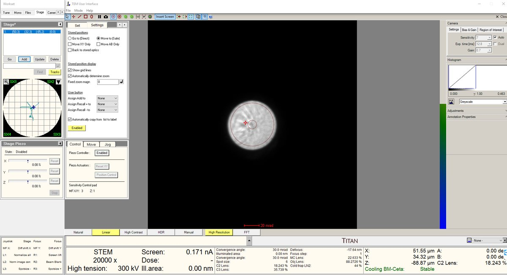

- After the blow-up point, you will see features. In this session, **cubes were found after the Ronchigram blow-up point**.

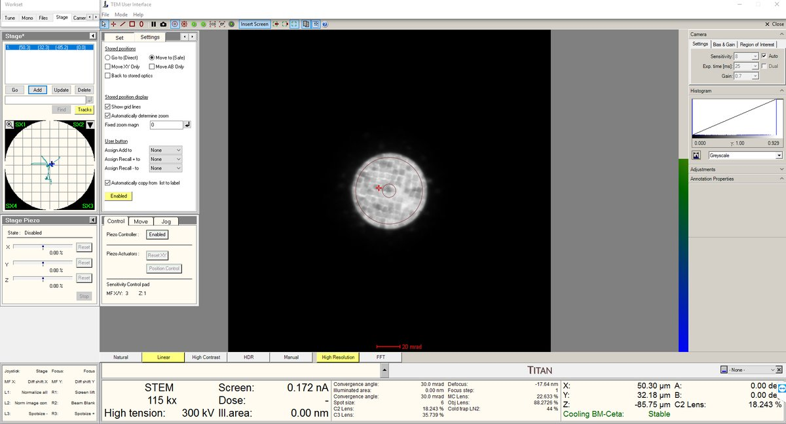

- Stay at the blow-up point. We are now at the **eucentric height**.
- Turn on the **HAADF camera in Velox** to observe those features.
- Use the **stage piezo** to move the sample around to ensure you have the sharpest features.
- Use **Sharpa** to correct **C1A1**. You do not need to correct **B2A2**.
- Take the image as usual.

## Mar 2, 2026: MAPED experience at NCEM

I had a chance to join TEAM MAPED session at NCEM with Stephanie Ribet and Henry Bell.

**Lessons learned**
- **LM mode warning:** In TEAM, LM mode isn't used generally. It turns off the aberration corrector, a set of multipole electromagnetic lenses (hexapoles, octupoles) that correct for spherical aberration. When switched back on, the corrector needs hours to restabilize both thermally (coils heat up, causing alignment drift from thermal expansion) and electromagnetically (currents must settle to precise values).
- I learned that using the **stigmator button** on the hand panel makes the beam round.
- **C2 adjust** is used to make the beam concentric, by aligning C2 aperture.
- **Rotation center:** don't care about the edges. Use a magnified image to see whether the features are pulsing out of the page.
- In Spectra, you can switch between TEM and STEM modes and it's stable. On TEAM, this is not the case, so it's better to use **STEM at 5k mag** to navigate and find samples. Use **stage double-click** to move around.

**Procedures and infrastructure (NCEM specific)**
- After loading a sample, watch PPL. It should go down to low 10⁻³ or 10⁻⁴. Octagon must be below 10 after sample loading.
- **Zone axis:** use **alpha and beta on the hand panel** to get an approximation, then go to Stage, flap out, and use alpha and beta for fine adjustment. Feel free to use camera length to make it easier to see. Ensure the ronchigram is symmetric.
- **Convergence angle:** change it by changing the aperture. C2 for 70 µm aperture gives ~9 mrad max. For higher convergence, use another aperture. If you change the C2 aperture, the software may still display the old value (e.g., "20") because it doesn't know how to get to the new position. Click **"Adjust"** to move to the new aperture. Then move C2 to ~30 (instead of 1,000) to block out other apertures.
- **Arina at NCEM:** HAADF must be out before you insert Arina. Verify on Digital Micrograph. Shutdown: voltage can be turned off from the software, no need to physically turn it off unlike at SNSF.
- **Column valve:** always close for lunch. It does not affect aberrations.
- **Modify current:** go to **Focus and Shift** under the `Mono` tab. This controls the monochromator lens excitation, which determines how tightly the beam is focused at the energy-selecting slit. Lowering focus means a less tight crossover at the slit, so more electrons pass through.
- **Descan pivot point:** TODO, see open questions at top.

## Nov 12, 2025: My first ptychography shadow at SNSF

I was able to join Dasol's session and shadow the ptychography workflow.

**Lessons learned**
- **Why scan often (not acquire)?** Tilting causes the field of view to shift, so I need to re-scan to keep track of where I am.
- **Why 14,000x mag for finding zone axis?** I can see the amorphous region and the ronchigram simultaneously. The amorphous region serves as a visual anchor.
- **Recording tilt direction:** record which tilt direction affects the Kikuchi lines, so you know which way to tilt to reach zone axis.
- **Why wobble focus at 1.3 Mx?** To verify there are no aberrations and everything is nicely centered.
- **How to verify zone axis?** Compare with CrystalMaker simulated diffraction pattern and Kikuchi lines.
- **How to tell it's the major zone axis?** Thick bands in the Kikuchi pattern.
- **Ronchigram usefulness:** probe aberrations visible, Kikuchi lines tell you if you are on zone axis and if the sample is too thick. Faint ronchigram features indicate a thin sample. A physical way to determine thickness and zone axis.
- **DPC not good when defocused:** differential phase contrast does not work well at large defocus because the center of mass is shared across too many overlapping regions.

**Procedures and infrastructure (ptychography specific)**
- **Beam-sensitive sample strategy:** Still scan, but on a small window so that the beam doesn't damage other areas. Move to another region after imaging.
- **Damaging beam intensity:** 50 pA was enough to damage the sample.
- **Lower voltage option:** 50 keV might help reduce damage but requires Andrew's help and a full day. The system needs to be stabilized at the new voltage.
- **Beam-sensitive challenge:** you take pictures "blindfolded": you don't actually see the sample until you release the electrons, which then damage it. Examples: battery materials, energy materials, 2D materials. Despite this, TEM is still used for the resolution.
- **Sample thickness:** 20 nm to 50 nm depending on scattering strength. Stronger scattering requires thinner samples.
- **Depth resolution:** 2 nm to 3 nm possible with multislice ptychography. Greater aperture may allow higher depth resolution (needs verification).
- **EMPAD1 data rates:** 128x128 pixels with 1 ms dwell time means >1 min per scan. One dataset is ~4 GB. 20 datasets produce ~80 GB. At NCEM, more pixels per session result in terabytes of data.

Discord for ptychography community: [https://discord.com/invite/SNmQ9XVa](https://discord.com/invite/SNmQ9XVa)
