# Spot size and convergence angle

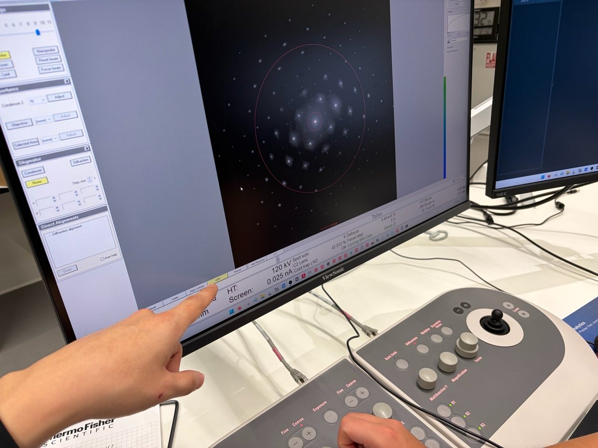

> [!CAUTION]
> **VERY ROUGH DRAFT, NOT AUTHORITATIVE.** Week 3 TEM class lab taught by **Andrew B.** on 2026-04-21. Photos, notes, and data captured by @bobleesj (Sangjoon Bob Lee) during the session as a student. Terminology, step ordering, and values may be wrong or incomplete. Analysis prompts from the lab handout are left as **TODO** for the lab report. Treat this page as a personal study reference, not an SOP. A trained user must verify everything before relying on it.

This page documents a Week 3 class lab on the Talos TEM covering two themes: (1A) how spot size and C2 aperture control the condenser lenses and screen current, and (1B) how the C2 lens changes illumination between parallel, convergent, and defocused conditions, and how that choice distinguishes image mode from diffraction mode.

**Links:**

- SNSF Talos reservation / info page: **TODO**
- Thermo Fisher Talos L120C product page: **TODO**

**System specifications (observed):**

| | |
|---|---|
| Model | Talos (Thermo Fisher) |
| Accelerating voltage | 120 kV (session value; instrument also supports others) |
| Camera | BM-Ceta |
| C2 apertures tested | 70 µm, 50 µm (handout also lists 150 µm, 100 µm) |
| Probe modes | Microprobe (used in this session), Nanoprobe |
| Magnification range observed | 5,300× (imaging) to 45,000× (for Theme 1B convergent work) |

**Acronyms:**

- `C1` : first condenser lens (spot-size lens)
- `C2` : second condenser lens (intensity / illumination lens)
- `SA` : selected area
- `CL` : camera length
- `DP` : diffraction pattern
- `TIA` : TEM Imaging and Analysis (Thermo Fisher software)
- `mulXY` : multifunction X/Y knobs on the hand panel
- `R1`, `R3`, `L3` : buttons on the hand control pad (R1 raises/lowers the fluorescent screen; R3 / L3 step spot size up / down)

## Overview

| Theme | What you study | Output |
|-------|----------------|--------|
| [1A: Beam parameters](#theme-1a-beam-parameters) | Spot size 1–11 × two C2 apertures; record C1, C2, screen current, camera length | Data tables, plots, convergence-angle analysis for lab report |
| [1B: C2 lens & illumination for diffraction](#theme-1b-c2-lens-and-illumination-for-diffraction) | Parallel vs convergent vs defocused beam on oriented gold; lens values in image vs diffraction mode | Lens-value table, C2-condition table, ray diagram sketch |

## Theme 1A: How do spot size and C2 aperture shape the beam?

### The question

The beam that reaches the sample is the product of two things: the condenser lens system (C1 sets the spot size, C2 sets the illumination) and the condenser aperture selection. Three sub-questions to address:

1. When the spot-size knob is stepped, what actually moves? Only C1? Or C2 as well?
2. The intensity knob clearly moves C2. Does it move C1 too?
3. How much does the aperture change matter? Is a 70 µm aperture really that different from 50 µm at the same spot size?

### Experimental setup

The microscope is fixed at 120 kV, 5,300× magnification, with the gold specimen loaded. At each spot size from 1 to 11, the beam is focused to crossover (beam diameter at its minimum on the phosphor screen) using the intensity knob, then C1, C2, and screen current are read from the TIA `System Status` panel and the status bar. Spot size is stepped with the `R3` / `L3` hand-panel buttons. The full sweep is run twice: once with a 70 µm C2 aperture, once with 50 µm.

Separately, at spot sizes 3 and 9, the instrument is switched to diffraction mode and the camera length is dialed until the beam matches the 5 mm phosphor ring. This measures how much camera length the aperture change costs.

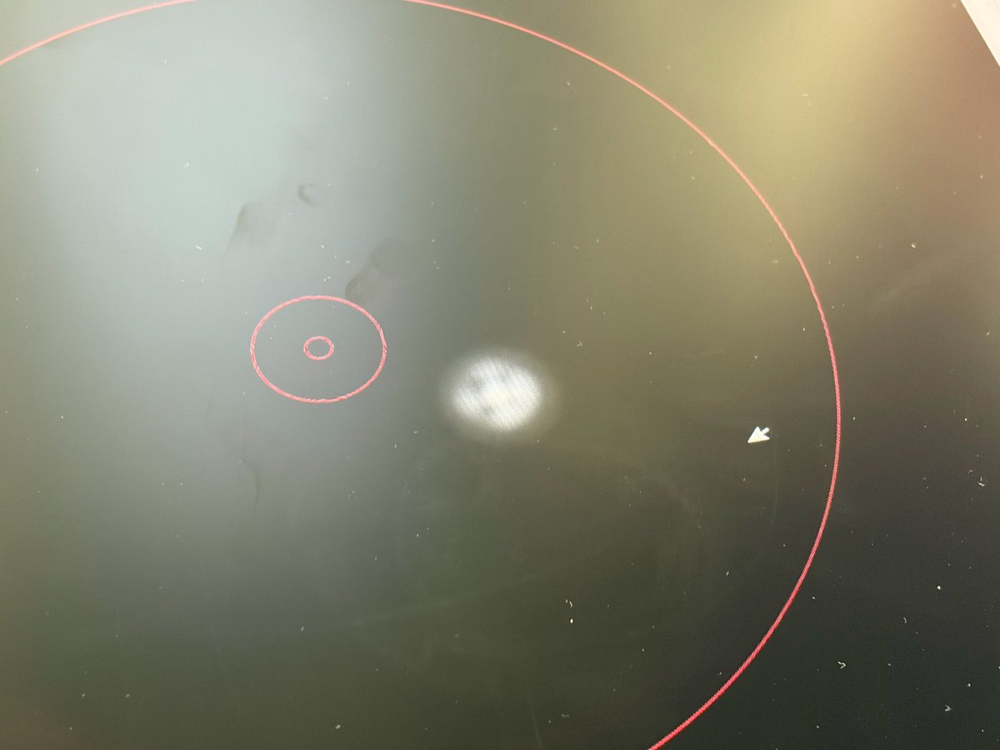

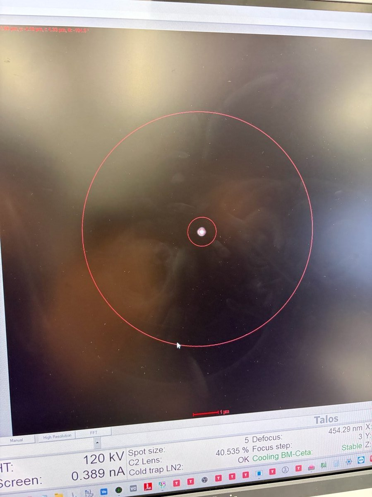

### Data: 70 µm C2 at 5,300× magnification

| Spot size | C1 (%) | C2 (%) | Screen current (nA) |
|-----------|--------|--------|---------------------|
| 1  | 16.64 | 44.52  | 5.80  |
| 2  | 18.18 | 43.18  | 3.09  |
| 3  | 20.12 | 42.16  | 1.82  |
| 4  | 23.60 | 41.10  | 0.737 |
| 5  | 27.47 | 40.53  | 0.197 |
| 6  | 32.11 | 40.14  | 0.200 |
| 7  | 36.76 | 39.837 | 0.113 |
| 8  | 44.11 | 39.639 | 0.055 |
| 9  | 58.15 | 39.435 | 0.030 |
| 10 | 63.84 | 39.233 | 0     |
| 11 | 93.24 | 38.991 | 0     |

### Data: 50 µm C2 at 5,300× magnification

| Spot size | C1 (%) | C2 (%) | Screen current (nA) |
|-----------|--------|--------|---------------------|
| 1  | 16.64 | 44.55  | 2.87  |
| 2  | 18.18 | 43.16  | 1.53  |
| 3  | 20.12 | 42.18  | 0.82  |
| 4  | 23.60 | 41.11  | 0.355 |
| 5  | 27.74 | 40.73  | 0.174 |
| 6  | 32.11 | 40.146 | 0.088 |
| 7  | 36.76 | 39.87  | 0.050 |
| 8  | 44.11 | 39.604 | 0.025 |
| 9  | 51.85 | 39.47  | 0     |
| 10 | 63.84 | 39.22  | 0     |
| 11 | 93.24 | 39.02  | 0     |

### Diffraction camera length for a 5 mm beam

| Spot size | CL at 70 µm C2 | CL at 50 µm C2 |
|-----------|----------------|----------------|
| 3 | 1.75 m | 2.2 m |
| 9 | 1.75 m | TODO (not recorded) |

### Plots

### Findings

- **Spot size drives C1, not C2.** C1 swings from ~17% at spot 1 to ~93% at spot 11, a factor of 5. C2 drifts from ~44.5% to ~39%, only about 5 percentage points.
- **The aperture barely moves the lenses.** The 70 µm and 50 µm curves sit on top of each other in both C1 and C2 plots. The aperture clips the beam; it doesn't reshape the lens system.
- **The intensity knob moves C2 but not C1** (confirmed by watching the System Status panel while turning intensity).
- **Screen current drops ~30× from spot 1 to spot 9** at fixed aperture: approximately exponential on the log-y plot.
- **70 µm delivers ~2× the screen current of 50 µm** at every spot above the detection limit. The area ratio is (70/50)² ≈ 2, which matches: the aperture really is just clipping.
- **A 5 mm beam needs longer camera length at 50 µm C2.** At spot 3: 1.75 m (70 µm) vs 2.2 m (50 µm). Less beam, so more camera length is needed to magnify it to the same ring.

### Open questions

> **Open questions (for the lab report):**
> - [ ] Draw the ray diagram of the two-condenser lens system (C1, C2, aperture, specimen plane). Use it to explain why C1 dominates and why the aperture doesn't change the lens values.
> - [ ] Why is C1 so *low* (16.64%) at spot size 1? A smaller spot needs a stronger C1, so shouldn't it be higher?
> - [ ] Determine the convergence angle α at spots 3 and 9 for each aperture.
> - [ ] Why is the 5 mm-beam CL longer at 50 µm than 70 µm? Is it just the current-times-CL invariance, or is the ray geometry fundamentally different?

## Theme 1B: How does the C2 lens switch between parallel and convergent illumination?

### The question

Theme 1A focused on the beam at crossover. But the beam has more states than that: it can be parallel, convergent to a point, or defocused on either side of crossover. Each state changes what the sample sees, and the switch between image mode and diffraction mode on a TEM is really just a choice of which lenses are doing what.

Two sub-questions to address:

1. When the instrument switches between imaging and diffraction modes, **which lenses actually change values?** Is it really a C2 thing, or do the post-sample lenses do the heavy lifting?
2. What does the beam at the sample look like when defocused clockwise vs counter-clockwise through crossover? Are the two sides symmetric, or does something meaningful change?

The sample is a commercially-available oriented gold standard: evaporated to ~11 nm, (100) orientation, loaded in a double-tilt holder and aligned to its zone axis before the session started.

### Experimental setup

Two sub-experiments.

**Experiment 1: lens values in image vs diffraction mode.** At 5,300× magnification with C2 = 70 µm and spot size 9, the beam is expanded clockwise through crossover until the diffraction pattern becomes sharp (parallel illumination). The four post-sample lens values (Diffraction, Intermediate, Projector 1, Projector 2) are recorded from the `System Status` panel in image mode, then again after switching to diffraction mode with CL = 420 mm.

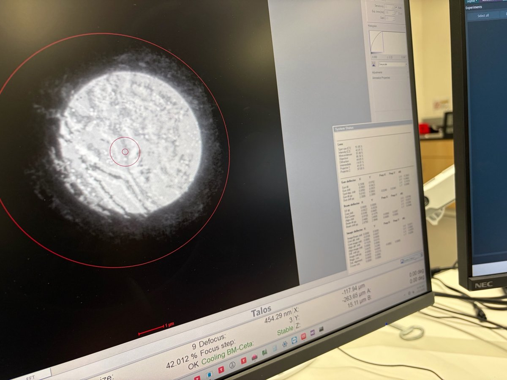

**Experiment 2: sweeping through crossover.** Camera length is increased to 2.2 m and magnification to 45,000×. The beam is focused to a point on the phosphor, and the central disk is centered with `mulXY`. The intensity knob is then turned **clockwise** from the focused point until features reappear inside the central disk; next, counter-**clockwise** through crossover and past it until features reappear on the other side. An image is acquired at each stopping point, along with the C2 value.

> Note: if the phosphor screen "flaps" when `R1` is pressed, press again until it settles in the desired position. This is normal instrument behavior.

### Lens values: image mode vs diffraction mode

| Lens | Image mode (%) | Diffraction mode (%) |
|------|----------------|----------------------|
| Diffraction  | 44.65  | 28.42  |
| Intermediate | -14.81 | -0.281 |
| Projector 1  | 41.81  | 52.84  |
| Projector 2  | 97.09  | 98.07  |

### C2 lens conditions at 45,000× (2.2 m CL except where noted)

The rows of this table trace the actual experimental walk through the C2 knob. Read from top to bottom, they are the successive states the beam passed through during Experiment 2:

1. **Parallel** (start): beam expanded post-crossover, diffraction pattern sharp, C2 = 42.01%.
2. **Convergent** (at crossover): C2 turned clockwise into crossover so the beam focuses to a point on the phosphor. Central disk is featureless with only a few scattered spots. This is the reference point for the defocus sweep.
3. **Defocused clockwise from focus**: from crossover, C2 is nudged further clockwise (slightly stronger) until features reappear inside the central disk. C2 = 40.06%, beam diameter ≈ 1.28 µm.
4. **Back through focus, then defocused counter-clockwise**: C2 is rotated counter-clockwise past crossover until features appear again. C2 = 38.663%, beam diameter ≈ 1.39 µm. Features look the same as in step 3, but the real-space orientation is **flipped**.

| Step | C2 condition | Mag | C2 value | Beam diameter | CL | Diffraction pattern / central disk |
|------|--------------|-----|---------|----------------|----|------------------------------------|
| 1 | Parallel (start)         | 5,300×  | 42.01  | 5.25 µm  | 420 mm | Sharp, parallel beam |
| 2 | Convergent (at crossover) | 45,000× | 39.396 | 73 nm    | 2.2 m  | Beam focused to a point, featureless with a few scattered spots |
| 3 | Defocused clockwise       | 45,000× | 40.06  | 1.281 µm | 2.2 m  | Nudged CW from crossover until features reappeared in the central disk |
| 4 | Defocused counter-clockwise | 45,000× | 38.663 | 1.39 µm  | 2.2 m  | Passed back through crossover; same-looking image, but flipped in real space |

The C2 values for steps 3 and 4 straddle the crossover value (39.396%) by roughly ±0.7 percentage points in either direction. The `~0.7%` offset is how far the intensity knob had to travel past crossover before the central disk showed features again.

### Findings

- **Switching image to diffraction mode moves *every* post-sample lens, but the real story is the Intermediate lens turning off.**
    - Diffraction lens: 44.65% → 28.42% (gets *weaker*)
    - Intermediate lens: -14.81% → -0.281% (essentially **off**)
    - Projector 1: 41.81% → 52.84% (gets stronger)
    - Projector 2: 97.09% → 98.07% (barely changes)
- The lens names are historical, not functional: the "Diffraction lens" is just the first projection lens after the objective, not a lens that's active only in diffraction mode. The actual mode switch is the Intermediate lens dropping to ~0%. When the Intermediate is on, it re-images the objective's intermediate image plane (real-space image of the sample) down the column. When it's off, the system projects the back focal plane (the diffraction pattern) directly onto the viewing screen. Projector 1 then gets stronger to magnify the BFP to fill the screen; the Diffraction lens can slacken because the chain has one fewer stage doing work.
- **Counter-intuitive direction:** the Diffraction lens getting *weaker* in diffraction mode is surprising on first read. It makes sense once the Intermediate-lens-as-mode-switch picture is in hand, but it's worth flagging. See open question below.
- **C2 values for each beam condition are close but not identical.** Parallel at 5,300× is C2 = 42.01%. Convergent (beam focused to a point) at 45,000× is C2 = 39.396%. Defocused on either side of crossover is ±1% around the crossover value.
- **Defocus clockwise and counter-clockwise through crossover produce images that look the same, but are flipped in real space.** This is the key observation: past crossover, the beam inverts. Features you saw on the left end up on the right.
- **"350 mm CL shows many Bragg peaks; 2.2 m CL is what makes the magnification value work out."** Short CL = wider diffraction pattern, more spots; long CL = tighter, cleaner central disk for quantitative work.
- **Thermo Fisher's mental model: the beam is the reference point.** Start from parallel illumination in image mode; watching how the beam converges or diverges as you adjust C2 is how you reason about every other mode.

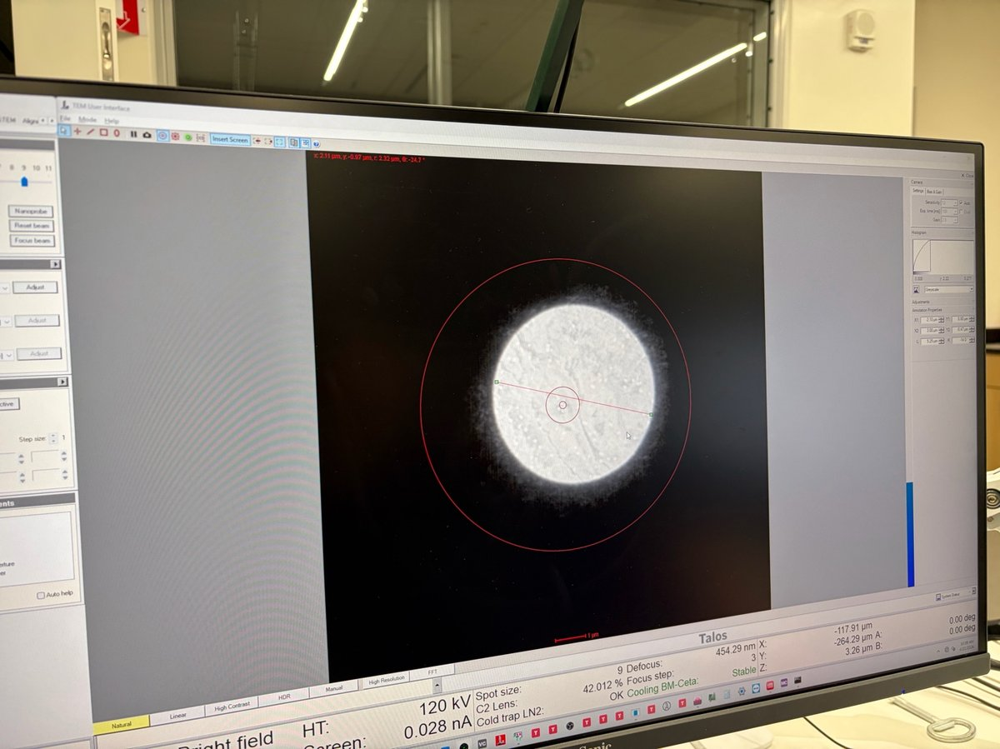

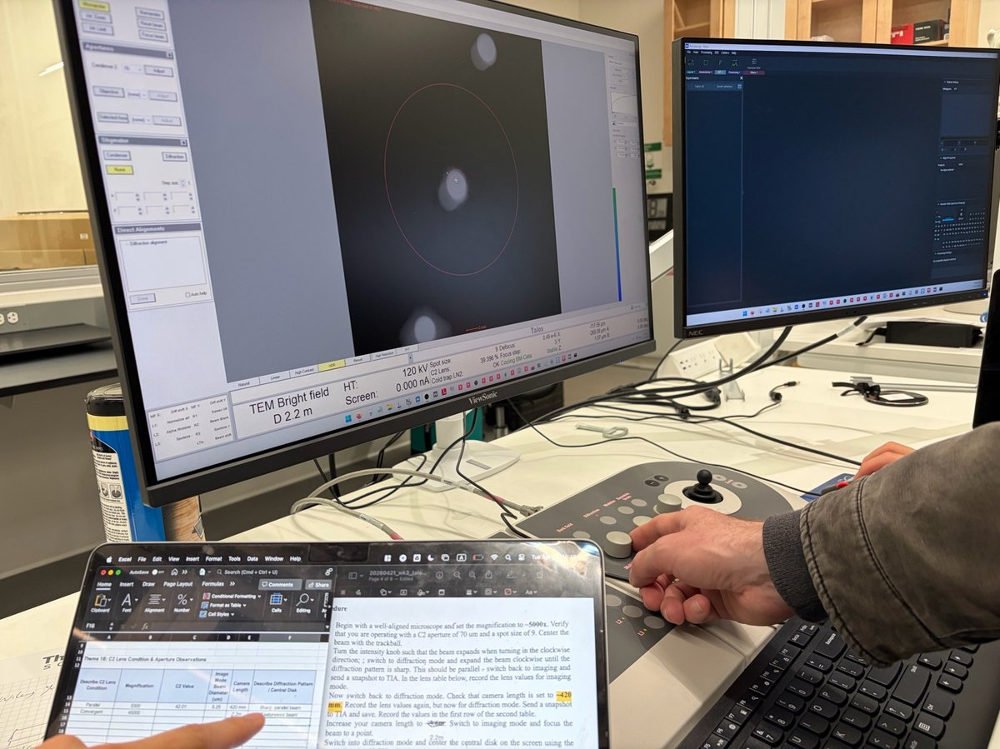

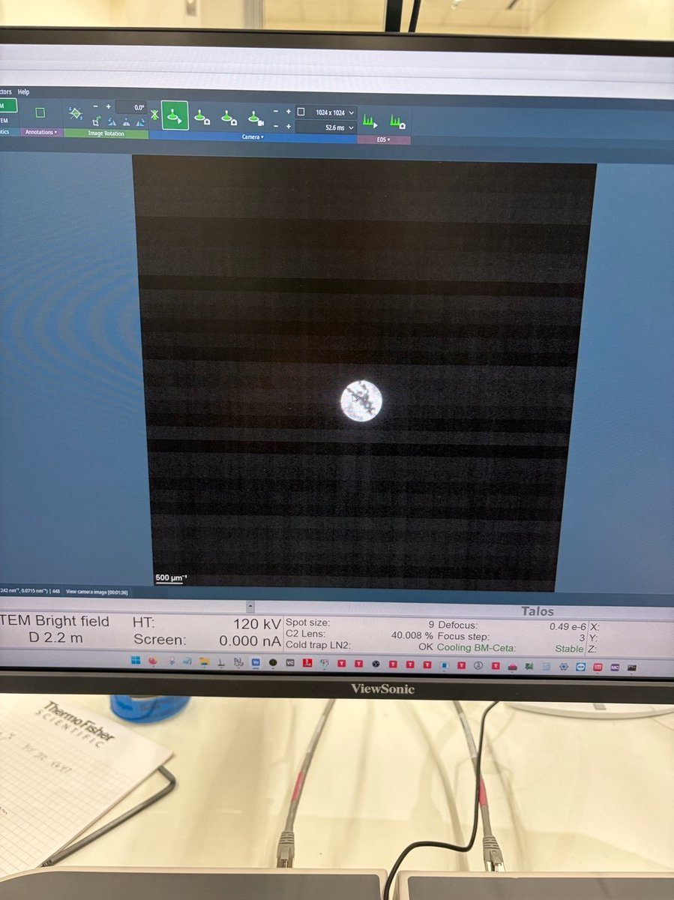

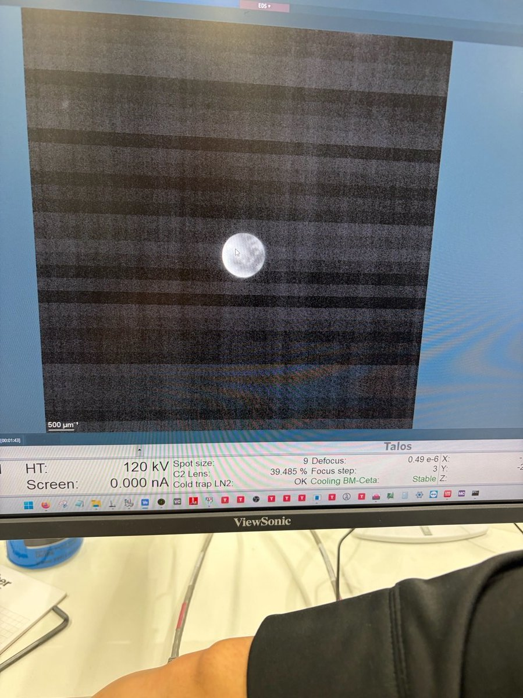

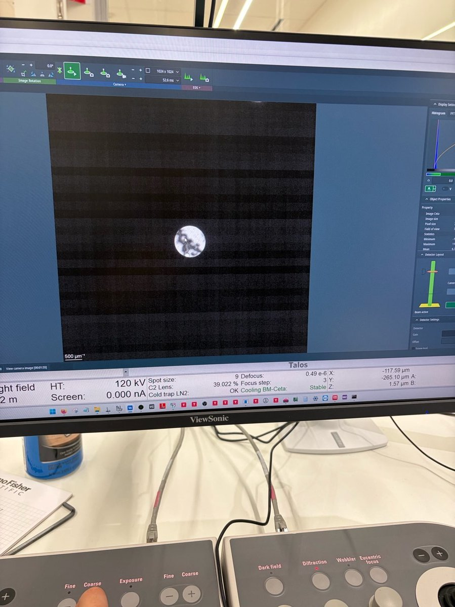

### The whiteboard sketch: over-focus vs under-focus

Andrew drew this at the whiteboard to explain why CW and CCW defocus produce flipped images.

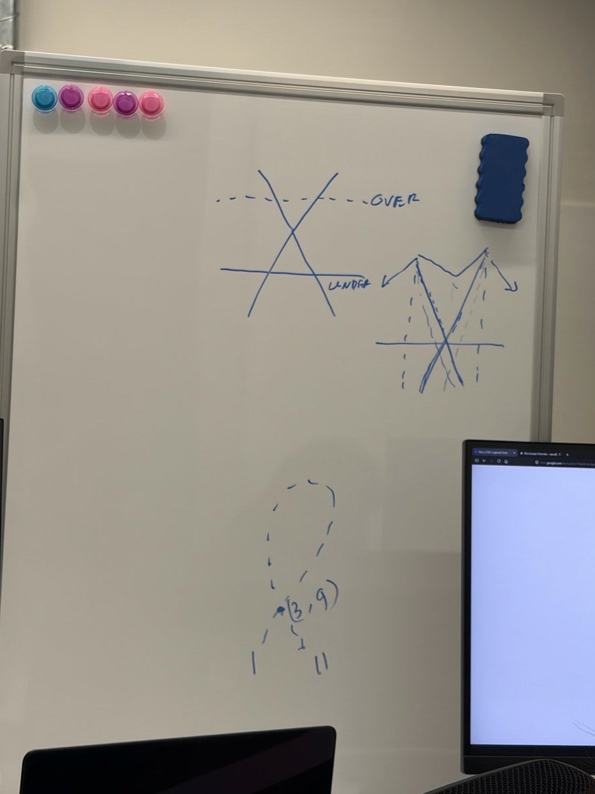

When the beam crossover sits **above** the sample plane (OVER-focus), the rays have already crossed by the time they hit the sample, so left/right is inverted. When the crossover sits **below** the sample plane (UNDER-focus), the rays haven't crossed yet, so the orientation is preserved. Passing through crossover literally swaps over- and under-focus, hence the real-space flip.

### Open questions

> **For the lab report:**
> - [ ] Draw the ray diagrams for parallel illumination in image mode and in diffraction mode (two-condenser lens system, C2, specimen plane, back focal plane). What exactly changes between the two modes?
> - [ ] Use the ray diagrams to explain the clockwise-vs-counter-clockwise flip quantitatively. What's the geometric signature of crossover being above vs below the specimen?
> - [ ] Ceta camera has 14 µm physical pixels. At binning 4 (1024×1024 output), effective sensor pixel = 56 µm. Work out the effective real-space pixel size at 300 kV and at 120 kV.
> - [ ] Verify with ray diagrams: does the Intermediate lens really act as the mode switch (on = image mode, off = diffraction mode)? If so, why does the Diffraction lens get *weaker* in diffraction mode rather than stronger? Work through the conjugate-plane math for both configurations.

## Appendix: Microprobe vs Nanoprobe

This lab was run entirely in **Microprobe** mode. Nanoprobe is used in cryoEM to reduce beam damage (smaller probe, lower dose per unit area).

> In Nanoprobe mode, the mini-lens, second condenser lens, and objective lens are used differently to produce a smaller probe at the sample. The convergence angle changes accordingly.

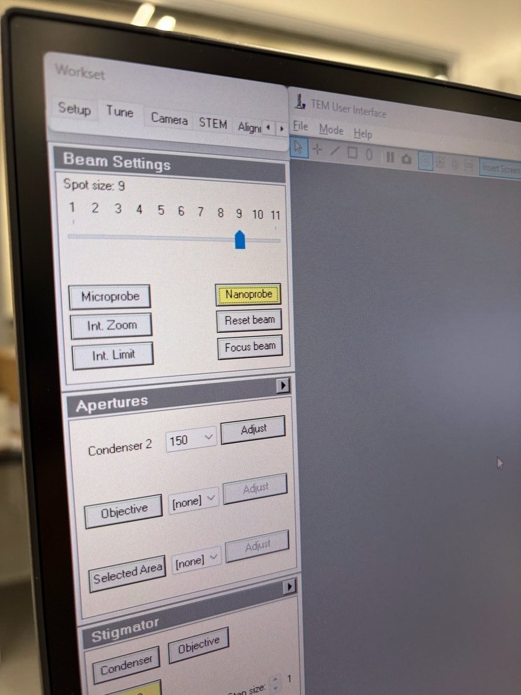

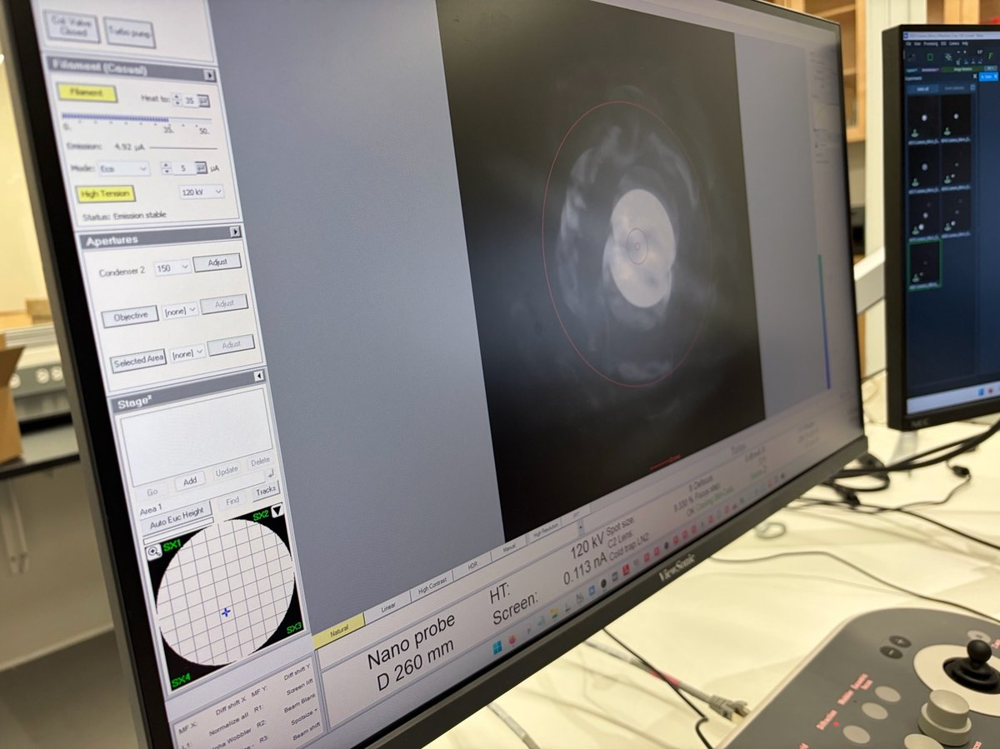

## Changelog

- Apr 22, 2026 : Initial draft from the 2026-04-21 Week 3 TEM class lab taught by Andrew B. Photos, notes, and measurements by @bobleesj. Plots generated from the xlsx data sheet. Analysis prompts and ray diagrams left as TODO for the lab report.
